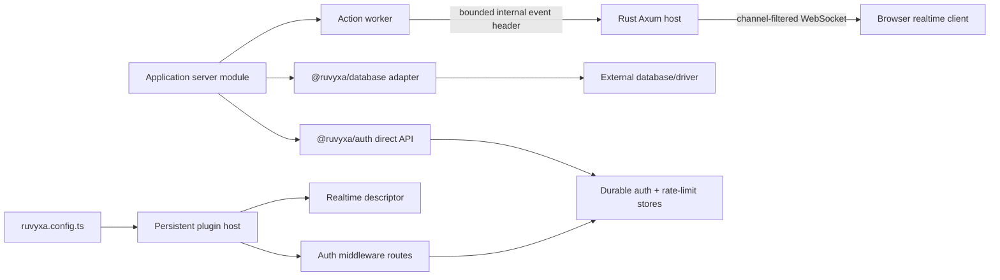

# Official Data, Auth, and Realtime Packages

Ruvyxa ships three focused first-party packages for application state. They use public framework
contracts, but they do not pretend that JavaScript module state is shared across Ruvyxa processes.



## Process ownership

- Config/build plugins and request middleware run in one or more persistent Node/Bun plugin hosts.
- Pages, API handlers, and server actions run in separate render workers.
- The Rust host owns HTTP limits, same-origin WebSocket handshakes, broadcast capacity, heartbeat,
  and connection cleanup.
- Serverless functions have independent lifecycles and do not run the Rust WebSocket host.

Consequently, database pools belong to the selected driver in each server process, auth sessions
belong to a durable external store, and realtime action events cross the existing worker protocol.
None of the packages relies on a process-global singleton shared between these boundaries.

## `@ruvyxa/database`

`createDatabase<Schema>(adapter)` exposes typed model delegates for `findMany`, `findFirst`,
`findUnique`, `create`, `createMany`, `update`, `updateMany`, `delete`, `deleteMany`, and `count`,
plus connection and transaction lifecycle methods. It validates pagination, single-record selectors,
write payloads, model names, and transaction capability before delegating.

| Backend    | Integration                                   | Ownership                                                 |
| ---------- | --------------------------------------------- | --------------------------------------------------------- |
| PostgreSQL | `prismaAdapter()` or custom `DatabaseAdapter` | Driver/ORM owns pooling and migrations                    |
| MySQL      | `prismaAdapter()` or custom `DatabaseAdapter` | Driver/ORM owns pooling and migrations                    |
| SQLite     | `prismaAdapter()` or custom `DatabaseAdapter` | Driver owns file locking and migrations                   |
| MongoDB    | `prismaAdapter()` or custom `DatabaseAdapter` | Driver/ORM owns connections and schema policy             |
| DynamoDB   | `dynamoAdapter({ transport, tables })`        | Transport owns AWS SDK commands, retries, and credentials |

The DynamoDB transport receives a normalized operation plus an explicit table name. This keeps the
framework independent of AWS SDK major versions while preserving a single application-facing API.
Unsupported operations must fail explicitly in the transport; they must never silently scan or
degrade transaction semantics.

`databasePlugin({ requiredEnv })` checks private database configuration at production build time and
rejects `RUVYXA_PUBLIC_*` database variables. Application database modules are server-only. The Rust
graph validator, native bundler, and Node compiler reject root imports from `@ruvyxa/database` in a
client graph with `RUV1007`.

## `@ruvyxa/auth`

`createAuth(options)` returns:

- `plugin` for the self-hosted Node/Bun middleware path;
- `handle(request)` for an API route or serverless/edge request lifecycle;
- `login`, `getSession`, and `logout` for server-only application code.

The default endpoint base is `/__ruvyxa/auth`:

| Endpoint                    | Method | Purpose                                                        |
| --------------------------- | ------ | -------------------------------------------------------------- |
| `/session`                  | GET    | Resolve the opaque session cookie                              |
| `/login/:provider`          | POST   | Credentials provider login                                     |
| `/logout`                   | POST   | Delete server state and expire the cookie                      |
| `/oauth/:provider/start`    | GET    | Create PKCE verifier/state and redirect                        |
| `/oauth/:provider/callback` | GET    | Atomically consume state, exchange code, resolve profile       |
| `/magic-link`               | POST   | Create and deliver a one-time email token                      |
| `/magic-link/callback`      | GET    | Atomically consume the email token and create a session        |
| `/webauthn/options`         | POST   | Delegate challenge/options creation                            |
| `/webauthn/verify`          | POST   | Delegate standards-compliant verification and create a session |

Security invariants:

- unsafe endpoints require the configured canonical `Origin`;
- bodies are streamed into a 32 KiB bound and invalid JSON fails closed;
- session and one-time token indexes are HMAC-SHA-256 derived from a 32+ character secret;
- cookies are opaque, HttpOnly, SameSite, path-bound, and Secure on HTTPS;
- OAuth uses PKCE S256, state bound to an HttpOnly initiating-browser cookie, single-use durable
  state, protected protocol parameters, HTTPS provider endpoints, bounded provider calls, and safe
  local return paths;
- magic links and OAuth state require atomic `AuthStore.take()` to prevent replay;
- rate limiting requires atomic `AuthRateLimitStore.consume()` and does not trust forwarded IPs;
- provider tokens never enter the browser session payload;
- process-local memory stores require `{ development: true }` and fail production plugin builds.

Google and GitHub helpers provide endpoints/profile mappings. Credentials verification, email
delivery, WebAuthn verification, user persistence, Redis/SQL storage, and password hashing remain
explicit application adapters because their policy and credential ownership cannot be inferred
safely by the framework.

The root `@ruvyxa/auth` entry is server-only and rejected from client graphs with `RUV1007`. Browser
code imports `createAuthClient` and public session types from `@ruvyxa/auth/client`.

## `@ruvyxa/realtime`

`realtime()` registers exactly one native transport through `enableRealtime()`. The descriptor is
validated on both the TypeScript and Rust sides. A server action opts in with:

```ts
export const updateTodo = action.realtime('todos').handler(async ({ input }) => {
  return db.todos.update(input)
})
```

After a successful action, the worker emits a bounded, base64url internal header. Rust validates and
removes that header, then broadcasts only this metadata:

```json
{
  "version": 1,
  "type": "action",
  "channels": ["todos"],
  "action": "updateTodo",
  "path": "/todos",
  "invalidated": ["todos"]
}
```

Action results, database rows, credentials, and private request data are not broadcast. Calling
`.realtime()` with no channel selects `route:<request pathname>`. The browser client reconnects with
bounded exponential backoff and asks Rust for only its active channels. A lagged broadcast receiver
gets a `resync` event and should refetch authoritative data.

Route channels longer than 128 characters use the same deterministic `route-hash:<id>` mapping in
the action worker and browser client. Event paths are capped at 2,048 characters, and at most 64
cache invalidation keys of 256 characters are included, keeping the internal envelope below its hard
transport limit without exposing action results.

| Deployment                                | Native realtime | Reason                                                      |
| ----------------------------------------- | --------------- | ----------------------------------------------------------- |
| `ruvyxa dev`                              | Yes             | Rust owns a long-running Axum/WebSocket process             |
| Self-hosted Node adapter / `ruvyxa start` | Yes             | Same long-running Rust host                                 |
| Self-hosted Bun adapter / `ruvyxa start`  | Yes             | Same host; Bun runs JS workers                              |
| Static                                    | No (`RUV3201`)  | No request or socket runtime                                |
| Vercel / Netlify serverless               | No (`RUV3201`)  | No portable persistent socket owner                         |
| Cloudflare/Edge                           | No (`RUV3201`)  | Current adapter contract has no Durable Object/broker owner |

One Rust instance provides production-safe bounded delivery for that instance. Horizontal fan-out
across several instances requires an external broker contract; it is intentionally not claimed in
this release.

## Failure and rollout behavior

- Configuration errors fail during config/plugin startup.
- Missing database secrets, non-durable production auth stores, and unsupported realtime targets
  fail during production build.
- Adapter/driver errors propagate with their causes. Auth passes full failures to the optional
  `onError` observability hook while public 500 responses hide internal details.
- All three packages are additive. Removing them from config/application imports restores the prior
  runtime path; no schema migration or generated artifact is owned by the framework.
