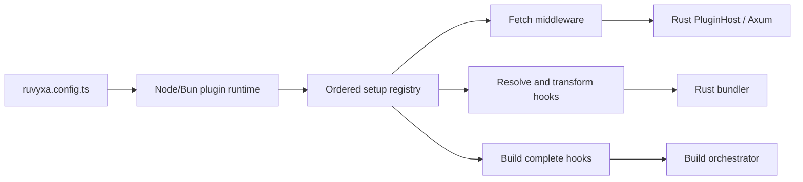

# Plugin Architecture

Ruvyxa plugins are application modules, not a second framework runtime. A plugin is a named object
created with `definePlugin` and a `setup` function. Setup receives a capability context:

```ts
import { definePlugin } from 'ruvyxa/config'

export default definePlugin({
  name: 'example',
  setup({ addMiddleware, resolveId, transform, onBuildComplete }) {
    addMiddleware({ onRequest: () => undefined })
    resolveId((specifier, importer, context) => undefined)
    transform((code, id, context) => ({ code }))
    onBuildComplete(({ root, outDir, manifest }) => {})
  },
})
```

## Ownership



Node owns module loading, callback execution, and JavaScript state. Rust owns process lifecycle,
ordering, protocol validation, HTTP limits, and integration with Axum and the Oxc bundler. The
registry is built once and all phases share the same module instances, so module-level caches and
closures behave like normal application code.

## Hook contracts

- `addMiddleware`: optional `routes`, `onRequest(Request, context)`, and
  `onResponse(Request, Response, context)` callbacks.
- `resolveId`: returns a project-relative or absolute module path, or `undefined`.
- `transform`: returns a string or `{ code, map }`, or `undefined` to continue.
- `onBuildComplete`: runs after the production output is committed and receives
  `{ root, outDir, manifest }`.

All hooks execute in registration order. The build and server bridges use the same persistent
runtime process, while a production build invokes the completion phase after output commit so a
plugin can write deployment metadata without racing the bundler.

## Design properties

- **Native application ergonomics:** standard imports, closures, `Request`/`Response`, and ordinary
  async functions.
- **One public model:** no parallel legacy plugin metadata, custom Rust layer list, or
  technology-specific permissions object.
- **Safe boundary:** only descriptors, strings, JSON metadata, and base64 bodies cross the process
  boundary; private environment values remain in the Node config process.
- **Deterministic lifecycle:** setup once, ordered hooks, bounded response buffering, explicit
  errors.
