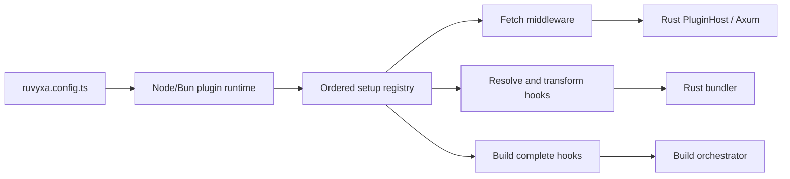

# Plugin Architecture

Ruvyxa plugins are JavaScript application modules, not a separate framework runtime. They are
defined in `ruvyxa.config.ts` via `definePlugin()` or the shorthand `plugin()`.

Both are exported from `@ruvyxa/core` (`ruvyxa/config`):

```ts
import { definePlugin } from 'ruvyxa/config'

export default definePlugin({
  name: 'example',
  setup({ addMiddleware, resolveId, transform, onBuildComplete }) {
    addMiddleware({ onRequest: () => undefined })
    resolveId((specifier, importer, context) => undefined)
    transform((code, id, context) => ({ code }))
    onBuildComplete(({ root, outDir, manifest }) => {})
  },
})
```

For simple middleware-only plugins:

```ts
import { plugin } from 'ruvyxa/config'

export default plugin('auth', async (request, context) => {
  if (!request.headers.has('authorization')) {
    return new Response('Unauthorized', { status: 401 })
  }
})
```

## Ownership



Node owns module loading, callback execution, and JavaScript state. Rust owns process lifecycle,
ordering, protocol validation, HTTP limits, and integration with Axum and the Oxc bundler. The
registry is built once and all phases share the same module instances, so module-level caches and
closures behave like normal application code.

## Hook contracts

### `addMiddleware(middleware)`

- `middleware` is either a `PluginRequestMiddleware` function
  `(Request, context) → Request | Response | void`
- Or a `PluginMiddleware` object with optional fields:
  - `routes?: string[]` — path patterns (exact or `*`-suffixed)
  - `onRequest?: PluginRequestMiddleware`
  - `onResponse?: PluginResponseMiddleware`

### `resolveId(hook)`

- `hook(id, importer, context) → string | null | void`
- First return that is not `null`/`undefined` wins

### `transform(hook)`

- `hook(code, id, context) → string | { code, map } | null | void`
- Chained: each host receives the previous output
- Return `undefined`/`null` to skip

### `onBuildComplete(hook)`

- `hook(context) → void | Promise<void>`
- Context: `{ root, outDir, manifest }`
- Runs after production output is committed and adapter artifacts are written

## Design properties

- **Standard web platform:** `Request`, `Response`, `Headers`, async functions
- **One public model:** no legacy plugin metadata or separate permissions object
- **Safe boundary:** only descriptors, strings, JSON metadata, and base64 bodies cross process
  boundary; private env values stay in Node config process
- **Deterministic lifecycle:** setup once, ordered hooks, bounded response buffering, explicit
  errors
