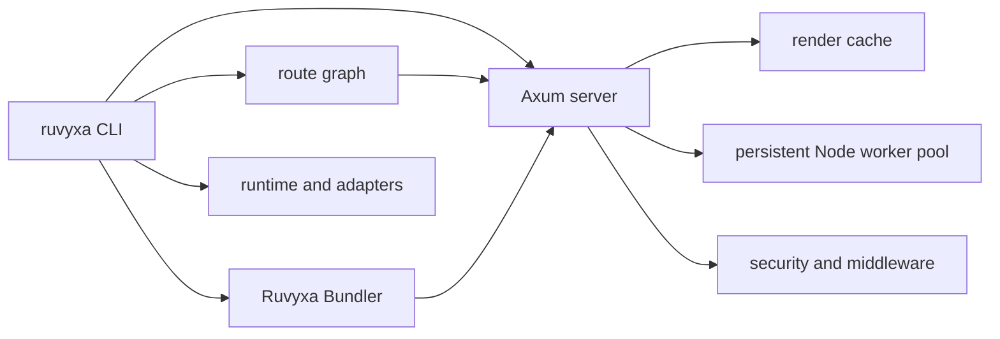

# Production-readiness assessment

## Scope

- Project: Ruvyxa monorepo
- Inspection date: 2026-07-19
- Intake scope: improve production readiness, throughput, and quality across the framework.
- Final documented scope: shared render cache, production pipeline, and release-quality gates.
- Pass level: Full Mode
- Pass reason: the request spans the CLI, bundler, development/server runtime, graph, middleware,
  packages, CI, and release flow.
- Inspection scope: root manifests, CI/release workflows, security policy, bundler architecture
  note, crate manifests, runtime cache source, and workspace test suites.
- Skipped areas: external deployment environment, CDN/WAF/TLS, secrets, production telemetry, and
  real production load; these are not present in the repository.

## Full hardening follow-up (2026-07-19)

The second audit covered the request/action boundary, Markdown rendering, CORS, Wasm loading,
static-file containment, error responses, release scripts, middleware resilience, and dependency
gates. No built-in authentication or database subsystem exists in this repository, so those controls
remain application/deployment responsibilities.

| Priority | Finding and root cause                                                                                                                                               | Correction                                                                                                                               | Status             |
| -------- | -------------------------------------------------------------------------------------------------------------------------------------------------------------------- | ---------------------------------------------------------------------------------------------------------------------------------------- | ------------------ |
| Critical | No direct Critical finding was evidenced in the repository audit.                                                                                                    | Keep release gates and deployment controls below in force.                                                                               | Closed by evidence |
| High     | Raw Markdown HTML was emitted with `dangerouslySetInnerHTML`, allowing stored/build-time XSS when content is untrusted.                                              | Render raw HTML as escaped text; MDX remains component-based and is still compiled separately.                                           | Fixed              |
| High     | Actions accepted missing/ambiguous media types, invalid UTF-8, and malformed JSON through permissive fallback parsing; missing browser origin evidence was accepted. | Require JSON or form media types, validate UTF-8/JSON strictly, preserve form payloads, and fail closed on missing same-origin evidence. | Fixed              |
| High     | Production error bodies and client overlays could expose internal paths/messages.                                                                                    | Log details server-side and return generic production error text; keep detail only in development.                                       | Fixed              |
| High     | Credentialed CORS allowed `*`, reflecting arbitrary origins.                                                                                                         | Reject wildcard origins whenever credentials are enabled and validate methods/headers.                                                   | Fixed              |
| High     | Wasm plugin paths were joined without canonical containment checks.                                                                                                  | Require safe project-relative `.wasm` paths and reject traversal/absolute/symlink escapes.                                               | Fixed              |
| High     | Configurable body/rate limits could be set to unbounded values.                                                                                                      | Enforce hard upper bounds in CLI validation and server startup.                                                                          | Fixed              |
| Medium   | Client/prerender symlinks could bypass path-segment checks.                                                                                                          | Canonicalize and require containment before reading files.                                                                               | Fixed              |
| Medium   | Mutex poisoning and SIGTERM registration used panic paths in request/shutdown code.                                                                                  | Fail closed for poisoned limiters and gracefully fall back to Ctrl-C when signal registration fails.                                     | Fixed              |
| Medium   | Request logs had no correlation identifier, making concurrent production failures difficult to trace.                                                                | Generate/propagate bounded `X-Request-ID` values and include them in structured request logs/responses.                                  | Fixed              |
| Medium   | Release smoke/publish scripts interpolated paths/commands into shells.                                                                                               | Use argument-array process execution (`execFileSync`/`spawnSync`) with platform-specific binaries.                                       | Fixed              |
| Medium   | Rust advisory scanning was not available locally and had no CI gate.                                                                                                 | Add scheduled/push/PR RustSec and npm audit workflow.                                                                                    | Fixed in CI        |
| Low      | `If-None-Match` handling ignored weak, list, and wildcard tags.                                                                                                      | Match normalized ETags according to HTTP list semantics.                                                                                 | Fixed              |

Direct fixes are covered by focused Rust/Node tests. The remaining unproved risks are deployment
controls (TLS, CSP policy, CDN/WAF, secret rotation, auth/session policy, database authorization)
and production-sized load/soak behavior.

## Confirmed facts

- The repository contains six Rust crates, a pnpm workspace with
  framework/runtime/packages/adapters, and a five-target CI matrix.
  - Evidence: `Cargo.toml`, `package.json`, `.github/workflows/ci.yml`.
  - Evidence strength: Direct.
- CI already enforces formatting, locked Rust tests, Clippy warnings as errors, package
  build/check/test, release metadata validation, and tarball smoke testing.
  - Evidence: `.github/workflows/ci.yml`.
  - Evidence strength: Direct.
- The render cache is shared by SSR and client bundle paths and stores an entry map plus FIFO queue.
  - Evidence: `crates/ruvyxa_dev_server/src/render_cache.rs`.
  - Evidence strength: Direct.
- Baseline and post-change verification passed: 351 Rust tests and the workspace package suites.
  - Evidence: local `cargo test --workspace --locked` and `pnpm -r test` runs on 2026-07-19.
  - Evidence strength: Direct.

## System summary

## Finding register

| #   | Finding                                                                                                      | Dimension         | Evidence                                                                                             | Impact                                                                                                                                                                                                                   | Severity | Confidence |
| --- | ------------------------------------------------------------------------------------------------------------ | ----------------- | ---------------------------------------------------------------------------------------------------- | ------------------------------------------------------------------------------------------------------------------------------------------------------------------------------------------------------------------------ | -------- | ---------- |
| 1   | Cache queue bookkeeping is not updated when an existing key is replaced or when an expired entry is removed. | Flow conflict     | `RenderCache::put`, `get`, and `get_arc` in `crates/ruvyxa_dev_server/src/render_cache.rs`.          | A stale queue entry can evict a fresh cache entry; after expiry the map can exceed configured capacity; repeated rewrites can grow the queue. This weakens latency and memory predictability under hot SSR/client paths. | High     | Direct     |
| 2   | The action rate limiter globally prunes all tracked client keys for every action request.                    | Performance debt  | `ActionRateLimiter::allow` in `crates/ruvyxa_dev_server/src/lib.rs`.                                 | Work per action grows with the number of tracked keys, extending the mutex-held hot path under high-cardinality traffic.                                                                                                 | High     | Direct     |
| 3   | Response-phase plugins buffer arbitrary response bodies with no size cap.                                    | Availability risk | `apply_response_plugins` in `crates/ruvyxa_dev_server/src/lib.rs` passed `usize::MAX` to `to_bytes`. | A large response can exhaust process memory when optional plugins are enabled.                                                                                                                                           | High     | Direct     |

## Approved correction

The user requested a production-readiness repair. The correction keeps queue and map membership
synchronized for replacement and expiry, makes zero capacity explicitly non-storing, and adds
focused regression tests. This preserves cache keys and public APIs and introduces no dependency.
Focused cache tests pass after the change.

The rate limiter now prunes only the active action key on its normal path. A bounded global cleanup
runs only when a new key arrives at capacity, preserving the same limit and memory bound while
avoiding a full-map scan for established clients.

Response-phase plugin buffering now defaults to 32 MiB and is configurable through
`security.pluginLimit` up to 256 MiB. Oversized responses fail with an explicit error instead of
allocating unbounded memory; payloads above that ceiling require a streaming design.

## Risks and operational limits

| Risk                                                                      | Evidence                                                                                                      | Mitigation                                                                                                     |
| ------------------------------------------------------------------------- | ------------------------------------------------------------------------------------------------------------- | -------------------------------------------------------------------------------------------------------------- |
| Deployment-layer controls cannot be proved locally.                       | `SECURITY.md` delegates TLS, CDN/WAF, secret rotation, CSP, and database policies to applications/deployment. | Apply environment-specific hardening and load/soak testing before release.                                     |
| Performance gains cannot be quantified without a representative workload. | Repository has CLI benchmarks and unit tests, but no captured production traffic profile.                     | Run `ruvyxa bench` and application load tests with production-sized routes after deployment topology is known. |

## Validation gate

1. Claim traceability: all findings and architecture claims cite inspected files or observed
   commands.
2. Scope alignment: this is a full-system assessment with a targeted, evidence-backed cache repair;
   no unapproved public contract change is included.
3. Handoff readiness: local production evidence is complete (`format:check`, locked Rust tests,
   workspace Clippy, package build/check/test, release validation, package smoke, and demo parity).
   Deployment topology and workload remain explicitly outside repository evidence.
