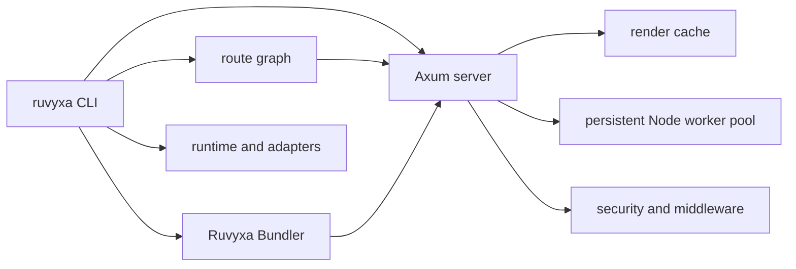

# Production-readiness assessment

## Scope

- Project: Ruvyxa monorepo
- Inspection date: 2026-07-13
- Intake scope: improve production readiness, throughput, and quality across the framework.
- Final documented scope: shared render cache, production pipeline, and release-quality gates.
- Pass level: Full Mode
- Pass reason: the request spans the CLI, bundler, development/server runtime, graph, middleware,
  packages, CI, and release flow.
- Inspection scope: root manifests, CI/release workflows, security policy, bundler architecture
  note, crate manifests, runtime cache source, and workspace test suites.
- Skipped areas: external deployment environment, CDN/WAF/TLS, secrets, production telemetry, and
  real production load; these are not present in the repository.

## Confirmed facts

- The repository contains six Rust crates, a pnpm workspace with
  framework/runtime/packages/adapters, and a five-target CI matrix.
  - Evidence: `Cargo.toml`, `package.json`, `.github/workflows/ci.yml`.
  - Evidence strength: Direct.
- CI already enforces formatting, locked Rust tests, Clippy warnings as errors, package
  build/check/test, release metadata validation, and tarball smoke testing.
  - Evidence: `.github/workflows/ci.yml`.
  - Evidence strength: Direct.
- The render cache is shared by SSR and client bundle paths and stores an entry map plus FIFO queue.
  - Evidence: `crates/ruvyxa_dev_server/src/render_cache.rs`.
  - Evidence strength: Direct.
- Baseline verification passed: 271 Rust tests and 60 package-test assertions.
  - Evidence: local `cargo test --workspace --locked` and `pnpm -r test` runs on 2026-07-13.
  - Evidence strength: Direct.

## System summary

## Finding register

| #   | Finding                                                                                                      | Dimension         | Evidence                                                                                             | Impact                                                                                                                                                                                                                   | Severity | Confidence |
| --- | ------------------------------------------------------------------------------------------------------------ | ----------------- | ---------------------------------------------------------------------------------------------------- | ------------------------------------------------------------------------------------------------------------------------------------------------------------------------------------------------------------------------ | -------- | ---------- |
| 1   | Cache queue bookkeeping is not updated when an existing key is replaced or when an expired entry is removed. | Flow conflict     | `RenderCache::put`, `get`, and `get_arc` in `crates/ruvyxa_dev_server/src/render_cache.rs`.          | A stale queue entry can evict a fresh cache entry; after expiry the map can exceed configured capacity; repeated rewrites can grow the queue. This weakens latency and memory predictability under hot SSR/client paths. | High     | Direct     |
| 2   | The action rate limiter globally prunes all tracked client keys for every action request.                    | Performance debt  | `ActionRateLimiter::allow` in `crates/ruvyxa_dev_server/src/lib.rs`.                                 | Work per action grows with the number of tracked keys, extending the mutex-held hot path under high-cardinality traffic.                                                                                                 | High     | Direct     |
| 3   | Response-phase plugins buffer arbitrary response bodies with no size cap.                                    | Availability risk | `apply_response_plugins` in `crates/ruvyxa_dev_server/src/lib.rs` passed `usize::MAX` to `to_bytes`. | A large response can exhaust process memory when optional plugins are enabled.                                                                                                                                           | High     | Direct     |

## Approved correction

The user requested a production-readiness repair. The correction keeps queue and map membership
synchronized for replacement and expiry, makes zero capacity explicitly non-storing, and adds
focused regression tests. This preserves cache keys and public APIs and introduces no dependency.
Focused cache tests pass after the change.

The rate limiter now prunes only the active action key on its normal path. A bounded global cleanup
runs only when a new key arrives at capacity, preserving the same limit and memory bound while
avoiding a full-map scan for established clients.

Response-phase plugin buffering now defaults to 32 MiB and is configurable through
`security.pluginLimit` up to 256 MiB. Oversized responses fail with an explicit error instead of
allocating unbounded memory; payloads above that ceiling require a streaming design.

## Risks and operational limits

| Risk                                                                      | Evidence                                                                                                      | Mitigation                                                                                                     |
| ------------------------------------------------------------------------- | ------------------------------------------------------------------------------------------------------------- | -------------------------------------------------------------------------------------------------------------- |
| Deployment-layer controls cannot be proved locally.                       | `SECURITY.md` delegates TLS, CDN/WAF, secret rotation, CSP, and database policies to applications/deployment. | Apply environment-specific hardening and load/soak testing before release.                                     |
| Performance gains cannot be quantified without a representative workload. | Repository has CLI benchmarks and unit tests, but no captured production traffic profile.                     | Run `ruvyxa bench` and application load tests with production-sized routes after deployment topology is known. |

## Validation gate

1. Claim traceability: all findings and architecture claims cite inspected files or observed
   commands.
2. Scope alignment: this is a full-system assessment with a targeted, evidence-backed cache repair;
   no unapproved public contract change is included.
3. Handoff readiness: local production evidence is complete (`format:check`, locked Rust tests,
   workspace Clippy, package build/check/test, release validation, package smoke, and demo parity).
   Deployment topology and workload remain explicitly outside repository evidence.
