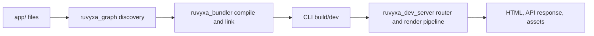

# Introduction

> **Tutorial goal:** choose the right starting point and understand the small app you will build.
> **Start from:** the [documentation index](README.md). **Checkpoint:** confirm that your machine
> meets the requirements, then continue to chapter 2.

Ruvyxa is intended for React applications that need file-system routes, server rendering, static
output, server actions, API routes, plugins, and a native build/dev pipeline without hiding the
deployment target. The public npm entry point is `ruvyxa`; React helpers live in `@ruvyxa/react`;
framework primitives live in `@ruvyxa/core` and are re-exported by `ruvyxa`.

## What is implemented

The route graph recognizes page, layout, API route, loading, error, and not-found files under the
configured app directory. A page may use SSR, SSG, ISR, CSR, or PPR. The CLI owns discovery,
validation, build, serving, analysis, and parity checking. Application code uses normal React and
Web `Request`/`Response` APIs.



## Requirements

- Node.js `>=24.19.0` is declared by the root and published JavaScript packages.
- Generated projects declare Node `>=24.19.0` and can be installed and run with npm. The framework
  monorepo itself uses pnpm `11.21.0`; that is relevant only to framework contributors.
- React and React DOM `19.2.8` are the template dependencies.
- A project needs a `package.json`, `ruvyxa.config.ts`, and an application directory (normally
  `app/`).

> **Scope note:** the framework supports `node`, `bun`, and `deno` runtime options in its
> CLI/config. Node remains the declared package prerequisite; install Bun or Deno only when
> selecting that runtime. Deno local tooling runs trusted project configuration and plugins with the
> required permissions (`-A --no-prompt`).

## Minimal outcome

```text
my-app/
├── app/
│   ├── layout.tsx
│   └── page.tsx
├── package.json
├── ruvyxa.config.ts
└── tsconfig.json
```

Start with [Create your first app](02-create-your-first-app.md). For a feature inventory backed by
source paths, see [Documentation scope and sources](18-documentation-scope-and-sources.md).

**Previous:** [Documentation index](README.md) · **Next:**
[Create your first app](02-create-your-first-app.md)
