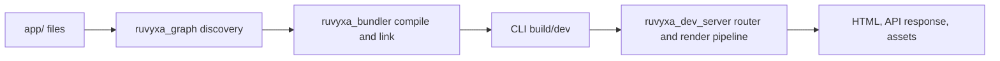

# Introduction

> **Tutorial goal:** choose the right starting point and understand the small app you will build.
> **Start from:** the [documentation index](README.md). **Checkpoint:** confirm that your machine
> meets the requirements, then continue to chapter 2.

Ruvyxa is intended for React applications that need file-system routes, server rendering, static
output, server actions, API routes, plugins, and a native build/dev pipeline without hiding the
deployment target. The public npm entry point is `ruvyxa`; React helpers live in `@ruvyxa/react`;
framework primitives live in `@ruvyxa/core` and are re-exported by `ruvyxa`.

## What is implemented

The route graph recognizes page, layout, API route, loading, error, and not-found files under the
configured app directory. A page may use SSR, SSG, ISR, CSR, or PPR. The CLI owns discovery,
validation, build, serving, analysis, and parity checking. Application code uses normal React and
Web `Request`/`Response` APIs.



## Requirements

To **build an app with Ruvyxa** you need only Node.js and a package manager. The compiler and server
are Rust, but they ship prebuilt: `npm install ruvyxa` resolves a `@ruvyxa/cli-<platform>` package
carrying the binary for your machine, so no Rust toolchain is involved.

This manual does not restate version numbers, because a number written here goes stale the moment a
release moves it. Each requirement below names the file that declares it, which is the copy that is
always right:

| You need             | Declared in                                                         |
| -------------------- | ------------------------------------------------------------------- |
| A Node.js floor      | `engines.node` in every published package and in generated projects |
| React and TypeScript | `dependencies` and `devDependencies` of the starter templates       |
| A package manager    | any of npm, pnpm, yarn, or bun — generated projects work with all   |

Run `ruvyxa doctor` in a project to see the versions actually resolved on your machine and which of
them are below the floor. A project also needs a `package.json`, a `ruvyxa.config.ts`, and an
application directory (normally `app/`).

To **work on the framework itself** you additionally need a Rust toolchain (edition 2024, floor in
`rust-version` in the workspace `Cargo.toml`) and the pnpm release pinned in `packageManager`. See
[Development and testing](12-development-testing.md).

> **Scope note:** the framework supports `node`, `bun`, and `deno` runtime options in its
> CLI/config. Node remains the declared package prerequisite; install Bun or Deno only when
> selecting that runtime. Deno local tooling runs trusted project configuration and plugins with the
> required permissions (`-A --no-prompt`).

## Minimal outcome

```text
my-app/
├── app/
│   ├── layout.tsx
│   └── page.tsx
├── package.json
├── ruvyxa.config.ts
└── tsconfig.json
```

Start with [Create your first app](02-create-your-first-app.md). For a feature inventory backed by
source paths, see [Documentation scope and sources](18-documentation-scope-and-sources.md).

**Previous:** [Documentation index](README.md) · **Next:**
[Create your first app](02-create-your-first-app.md)
