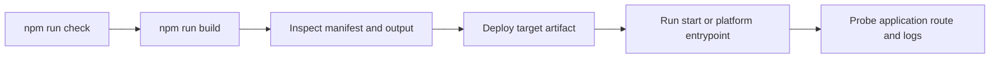

# Deploy, run, and operate in production

> **Tutorial goal:** turn a verified build into a deployable artifact with an explicit operating
> plan. **Start from:** the evidence you collected in
> [Observability and performance](14-observability-performance.md). **Checkpoint:** complete the
> pre-deploy commands and probe one application-owned health route.

## Build and select a target

```bash
npm run build
# or choose a target/adapter without changing config
npm run build -- --target static
npm run build -- --adapter node
```

The verified target values are `node`, `bun`, `deno`, `edge`, and `static`. Adapter selection
accepts Node, Bun, Deno, static, Vercel, Netlify, Cloudflare, Railway, Render, Firebase, AWS, or an
adapter package name. Adapters are build-output contracts; inspect the selected adapter package
before assuming platform configuration, health checks, or scaling semantics.

## Operations sequence



Before deployment, run `npm run check`, `npm run build`, and `npm run test:parity`; then inspect the
manifest/output and exercise a health route that your application implements (the `api` template
includes `app/api/health/route.ts`). The framework does not reserve or implement a universal
health/readiness endpoint.

## Production checklist

- Set `site.url` or private `RUVYXA_SITE_URL` to the real canonical origin before relying on
  generated sitemap URLs. Preview-only Vercel/Netlify URLs are intentionally not selected as
  canonical origins.
- Set an explicit server host/port only when running the Node/Bun/Deno process yourself. Let managed
  adapters own their generated entrypoint.
- Persist application state outside process memory. Core cache and auth memory stores are local to
  an instance; provide shared database/cache/session infrastructure where required.
- Configure log collection for structured records and redact at the sink. Wire infrastructure
  metrics/alerts, because the repository does not expose a built-in alert manager, backup service,
  queue worker, or scheduler.
- Use immutable build artifacts and a platform rollback mechanism. The source shows staging output
  that is moved into place only after a build completes, but it does not implement remote release
  orchestration or database rollback.

## What a deployed build serves

A build artifact runs the same request pipeline as `ruvyxa start`, not a reduced one:

| Feature                                                             | `dev` / `start` | Deployed build    |
| ------------------------------------------------------------------- | --------------- | ----------------- |
| Page routes and API routes                                          | yes             | yes               |
| Server actions (`POST /__ruvyxa/action`)                            | yes             | yes               |
| Plugin `http.onRequest` / `onResponse` / `route`                    | yes             | yes               |
| `@ruvyxa/auth` (built on plugin HTTP hooks)                         | yes             | yes               |
| On-demand images (`/__ruvyxa/image`)                                | yes             | adapter-dependent |
| Native realtime and presence                                        | yes             | no                |
| `security.apiLimit`, `security.headers`, `security.trustedProxyIps` | yes             | yes               |

Server actions and plugin HTTP hooks are compiled into the function artifact from `ruvyxa.config`,
so a project using either needs no extra configuration to deploy. Realtime and presence need a
socket upgrade that no build artifact can perform; `ruvyxa build` prints `RUV2205` naming the
endpoint that will be missing, and `ruvyxa check` reports the same under its capability parity rows.
Serve those projects with `ruvyxa start`.

Selecting an adapter that cannot serve something the project uses fails the build rather than
deploying a site that answers 404: a static adapter with a server action or a plugin HTTP route
reports `RUV2204`.

## The build output is a contract

One build deploys anywhere because the build describes itself. `ruvyxa build` writes a `deploy`
section into `manifest.json`: a versioned, provider-agnostic account of what was produced and how it
must be served. Every adapter reads it instead of re-deriving the same answers from route metadata,
and so can anything else you put in front of a build.

It is a section rather than a file of its own so that one manifest describes the build. The copy
that travels inside a function bundle has the section removed — how to serve a build is a build-time
question, and the running function has no use for the answer.

```jsonc
// .ruvyxa/manifest.json
{
  "appDir": "app",
  "routes": [/* the route graph, unchanged */],
  "deploy": {
    "version": 1,
    "framework": "ruvyxa",
    "buildId": "…", // derived from the emitted output, not a timestamp
    "directories": { "client": "client", "assets": "assets", "prerender": "prerender" },
    "routes": [
      {
        "path": "/",
        "serve": "static", // answerable from a file
        "strategy": "ssg",
        "document": "index.html",
        "cacheControl": "public, max-age=0, must-revalidate",
      },
      {
        "path": "/cached",
        "serve": "function", // must reach the server
        "strategy": "isr",
        "revalidate": 60,
        "cacheControl": "s-maxage=60, stale-while-revalidate",
      },
    ],
    "staticPaths": ["/"],
    "functionPaths": ["/cached", "/api/health"],
    "headers": [
      { "source": "/__ruvyxa/client/(.*)", "headers": { "cache-control": "…, immutable" } },
    ],
    "notFound": { "status": 404, "document": "404.html" },
  },
}
```

Three things in it are worth knowing even if you never read the file:

- **Static and dynamic are separated for you.** `serve: "static"` means a CDN may answer that URL
  from a file; `serve: "function"` means the request has to reach the server. An ISR or PPR page is
  always `function` even though a document exists for it — a host that answered from the file would
  serve the build-time snapshot forever and never invoke the code that revalidates it.
- **`buildId` is derived, never stamped.** It is a hash of what was emitted, so the same sources
  produce the same id and a changed output cannot keep the old one. That is what lets it sit inside
  a reproducible build.
- **`version` is a refusal point.** An adapter written against version 1 keeps working as fields are
  added; if the meaning of an existing field ever changes, the version moves and an older adapter
  refuses the build instead of misreading it.

`404.html` in the prerender output is the same idea. If your project has `app/not-found.tsx`, the
build renders it once, with your root layout and stylesheet: static hosts serve that file for an
unmatched URL with no configuration, and function builds carry the same bytes and answer with them.

## Reproducible builds

The same source and the same configuration produce the same output bytes, on any machine. This is a
property Ruvyxa enforces rather than hopes for:

- `localeCompare` and locale-sensitive case folding (`toLocaleLowerCase`, `toLocaleUpperCase`) are
  banned by lint, because both answer by the host's ICU locale. Ordering goes through explicit
  comparators instead.
- The Rust and JavaScript implementations of route matching, static asset typing, and prerender path
  safety are held to shared conformance fixtures, so the two languages cannot drift apart.
- Content hashes, not timestamps, decide cache identity.

Check it on your own project:

```bash
pnpm verify:reproducible --root path/to/project
```

It builds twice from clean, then compares every emitted file and sorts the differences by what they
mean:

- **Emitted code differing** is a defect and fails the check. It means something in the build
  depends on wall-clock time, iteration order, a random value, an absolute path, or the host locale.
- **Build telemetry** — `build.json`'s `createdAtUnix` and `timing`, and the cache counters in
  `client/manifest.json` that `ruvyxa bench` reads — describes how the build _ran_, so it varies by
  design and is reported without failing.
- **Prerendered HTML differing** is almost always your own page rendering a clock or a random value.
  Ruvyxa cannot tell that apart from a bug, so it is reported for you to judge.

Pass `--strict` to fail on all three, which is what you want if you are attesting that a deployment
artifact matches a specific commit.

## Answers that look like faults

Four responses are deliberate, and each one has been reported as a bug by someone testing a
deployment with a script rather than a browser.

**A URL containing `%2F` is answered `400`, not routed.** `/blog/a%2Fb` and `/blog/a/b` are
different requests, and a router that decoded the first into the second would let an encoded
separator cross a path boundary it was never allowed to cross. Ruvyxa rejects the request instead of
choosing an interpretation. Encode a slash-bearing value into a query parameter, or use a catch-all
segment.

**A server action posted without an `Origin` header is answered `403`.** The check is a CSRF
defence, and it fails closed: a request with no `Origin` and no `sec-fetch-site: same-origin` cannot
be shown to have come from your own site, so it is refused. Every browser sends one of the two on a
cross-document POST; `curl` sends neither. Add `-H "Origin: https://your-host"` when calling an
action by hand, or set `security.sameOrigin: false` if you are deliberately serving actions to
non-browser clients.

**A second `ruvyxa build` on the same output fails while the first is still running.** The build
takes a lock on its output directory. Two builds writing one directory produce a mixture of both,
and a mixture that starts is worse than a build that refuses. Wait, or build into a different
`--out-dir`.

**Node prints `DEP0190` when the standalone server starts a subprocess.** It comes from Node itself,
not from Ruvyxa, and names a deprecated spawn form used by a dependency in the chain. It is a
notice, not an error, and nothing in the deployment misbehaves because of it.

## Platform limits

Native realtime requires a long-lived Node/Bun build; Deno supports the full server route set but
does not host native realtime. A static adapter needs prerendered pages and cannot render arbitrary
SSR at runtime. Containers, Kubernetes, load balancers, backup/recovery, high availability, and
provider-specific configuration are not defined by this repository; choose and document them in your
deployment environment.

For the exact artifacts and verified handoff command for every first-party adapter, continue with
[Platform adapter guide](20-platform-adapter-guide.md). It separates generated provider files from
provider-owned setup so deployment instructions remain accurate.

**Previous:** [Observability and performance](14-observability-performance.md) · **Next:**
[Troubleshooting and upgrade compatibility](16-troubleshooting-upgrades.md)
