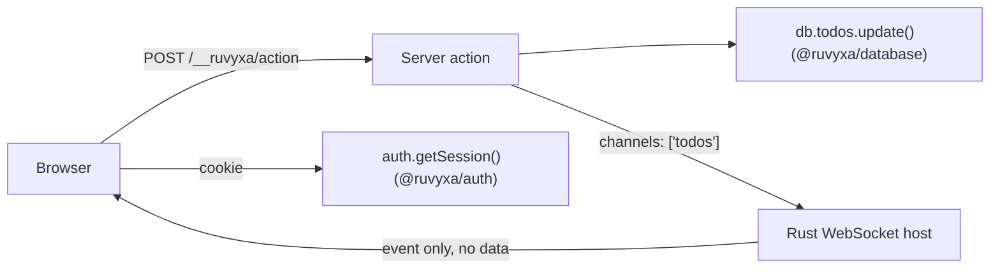

# Official Packages: Database, Auth & Realtime

> 🟡 **Intermediate** · ⏱️ ~10 min read
>
> **You'll learn:** add a typed database layer, login/sessions, and live UI updates — each package
> optional and removable without migration.

Ruvyxa ships three installable first-party packages for application state. Each one is optional,
additive, and removable — deleting the import restores the previous behavior with no migration.

| Package            | What it gives you                                                               | Runs where                      |
| ------------------ | ------------------------------------------------------------------------------- | ------------------------------- |
| `@ruvyxa/database` | One typed CRUD + transaction API over Prisma, DynamoDB, or a custom adapter     | Server only                     |
| `@ruvyxa/auth`     | Sessions, credentials login, OAuth (PKCE), magic links, WebAuthn, rate limiting | Server (+ small browser client) |
| `@ruvyxa/realtime` | Live UI updates pushed over a native WebSocket after server actions             | Self-hosted Node/Bun only       |

Install only what you need:

```bash
npm install @ruvyxa/database
npm install @ruvyxa/auth
npm install @ruvyxa/realtime
```

> **Beginner tip** — you do not need any of these to build your first app. Start with pages,
> loaders, and actions from the earlier chapters. Reach for these packages when you actually need a
> database, login, or live updates.

---

## `@ruvyxa/database` — one API over any database

### Why it exists

Every data-backed app repeats the same glue: connect a driver, wrap CRUD calls, validate inputs,
handle transactions. `createDatabase()` gives one typed facade so your pages and actions never care
which engine is behind it.

### Quick start (Prisma)

Prisma covers PostgreSQL, MySQL, SQLite, and MongoDB:

```ts
// lib/db.ts — server-only module
import { PrismaClient } from '@prisma/client'
import { createDatabase, prismaAdapter } from '@ruvyxa/database'

interface Schema {
  todos: { id: string; title: string; done: boolean }
}

const prisma = new PrismaClient()
export const db = createDatabase<Schema>(prismaAdapter(prisma))
```

Use it from a loader or server action:

```ts
// app/todos/loader.ts
import { db } from '../../lib/db'

export default async function loader() {
  return { todos: await db.todos.findMany({ take: 50 }) }
}
```

Model delegates support `findMany`, `findFirst`, `findUnique`, `create`, `createMany`, `update`,
`updateMany`, `delete`, `deleteMany`, and `count`, plus `db.$transaction(async (tx) => { ... })`
when the adapter supports transactions.

### DynamoDB

DynamoDB works through an explicit transport, so your AWS SDK version stays your choice:

```ts
import { createDatabase, dynamoAdapter } from '@ruvyxa/database'

export const db = createDatabase<Schema>(
  dynamoAdapter({
    transport: myDynamoTransport, // wraps AWS SDK v2, v3, or a local emulator
    tables: { todos: 'app-todos' }, // unknown models fail closed
  }),
)
```

### Build-time safety

Add `databasePlugin()` to fail the production build early when configuration is wrong:

```ts
// ruvyxa.config.ts
import { databasePlugin } from '@ruvyxa/database'
import { config } from 'ruvyxa/config'

export default config({
  plugins: [databasePlugin({ requiredEnv: ['DATABASE_URL'] })],
})
```

- Missing `DATABASE_URL` → build fails with a clear message instead of a runtime crash.
- A database variable named `RUVYXA_PUBLIC_*` → rejected, because that prefix ships to the browser.
- Importing `@ruvyxa/database` from client code → rejected with `RUV1007` at build time.

### Common mistakes

| Mistake                                          | What happens                            | Fix                                            |
| ------------------------------------------------ | --------------------------------------- | ---------------------------------------------- |
| Importing `lib/db.ts` from a `'use client'` file | Build fails with `RUV1007`              | Fetch through a loader, action, or API route   |
| Creating the client inside `ruvyxa.config.ts`    | Each process gets its own copy          | Create it in a server-only app module (`lib/`) |
| Using an unmapped Dynamo model                   | `RUV3002` error (fails closed, no scan) | Add the model to `tables`                      |

---

## `@ruvyxa/auth` — sessions and login flows

### What you get

`createAuth(options)` returns one isolated runtime:

- `plugin` — register in `ruvyxa.config.ts` for self-hosted middleware handling;
- `handle(request)` — call from an API route (works on serverless too);
- `login`, `getSession`, `logout` — direct server-side calls.

Sessions are **opaque cookies** backed by a store you own — no JWT pitfalls, instant revocation.

### Quick start (credentials)

```ts
// lib/auth.ts — server-only module
import { createAuth, memoryAuthStore, memoryRateLimitStore } from '@ruvyxa/auth'

export const auth = createAuth({
  secret: process.env.AUTH_SECRET!, // at least 32 characters
  origin: 'https://app.example.com',
  store: memoryAuthStore({ development: true }), // swap for Redis/SQL in production
  rateLimitStore: memoryRateLimitStore({ development: true }),
  providers: {
    email: {
      type: 'credentials',
      async authorize(input) {
        const user = await findUserByEmail(String(input.email))
        return user && (await verifyPassword(user, String(input.password))) ? user : null
      },
    },
  },
})
```

Register the middleware:

```ts
// ruvyxa.config.ts
import { config } from 'ruvyxa/config'
import { auth } from './lib/auth'

export default config({ plugins: [auth.plugin] })
```

The browser talks to `/__ruvyxa/auth/*` endpoints through the small client:

```ts
// any 'use client' component
import { createAuthClient } from '@ruvyxa/auth/client'

const client = createAuthClient()
await client.login('email', { email, password })
const session = await client.session()
client.oauth('google', '/dashboard') // redirects the browser to the OAuth start endpoint
await client.logout()
```

### OAuth in three lines

Google and GitHub helpers fill in endpoints and profile mapping:

```ts
import { github, google } from '@ruvyxa/auth'

providers: {
  google: google({ clientId: process.env.GOOGLE_ID!, clientSecret: process.env.GOOGLE_SECRET! }),
  github: github({ clientId: process.env.GITHUB_ID!, clientSecret: process.env.GITHUB_SECRET! }),
}
```

The helpers already contain the endpoints, default scopes, and profile mapping. The provider key
must match the helper's id (`google` under the `google` key). For any other OAuth provider, supply
the full
`{ type: 'oauth', id, authorizationUrl, tokenUrl, userInfoUrl, clientId, scopes, mapProfile }`
object yourself.

Send the browser to `/__ruvyxa/auth/oauth/google/start?returnTo=/dashboard`. Ruvyxa handles PKCE,
state, the token exchange, and the safe redirect back.

Magic links and WebAuthn follow the same pattern — you provide `send()` / `resolveUser()` for email
links, or `options()` / `verify()` delegates for passkeys, and the framework owns the endpoint flow,
replay protection, and rate limiting.

### Production requirements (checked for you)

A production build **fails** with `RUV3105` when session or rate-limit stores are not durable.
Memory stores require `{ development: true }` precisely so this cannot slip into production. Bring a
Redis, SQL, or KV implementation of the four-method `AuthStore` contract (`get`, `set`, `delete`,
atomic `take`) plus an atomic `consume()` rate-limit store.

### Security model in one paragraph

Unsafe endpoints require the canonical `Origin` header. Bodies are capped at 32 KiB and streamed.
Session keys are HMAC-SHA-256 derived — a leaked store never reveals raw tokens. OAuth uses PKCE
S256 with single-use state bound to the initiating browser. Magic links are consumed atomically
(`take`), so a link works exactly once. Rate limiting deliberately does not trust `X-Forwarded-For`.
Provider access tokens never reach the browser.

### Error codes

| Code      | Meaning                                            |
| --------- | -------------------------------------------------- |
| `RUV3100` | Internal auth failure (details hidden from client) |
| `RUV3101` | Invalid request/credentials or unknown provider    |
| `RUV3102` | Rate limited — includes `retry-after`              |
| `RUV3103` | Invalid/expired OAuth state or magic-link token    |
| `RUV3104` | Upstream OAuth provider failure                    |
| `RUV3105` | Production build with non-durable stores           |

---

## `@ruvyxa/realtime` — live updates after actions

### The mental model

You do **not** write WebSocket code. You tag a server action with the channels it affects; when the
action succeeds, every subscribed browser gets a small notification event — never the action result,
never database rows. The browser then refetches through its normal loader path.

### Enable the transport

```ts
// ruvyxa.config.ts
import { realtime } from '@ruvyxa/realtime'
import { config } from 'ruvyxa/config'

export default config({ plugins: [realtime()] })
```

### Tag an action

```ts
// app/todos/action.ts
export const addTodo = action
  .realtime('todos')
  .input(todoSchema)
  .handler(async ({ input }) => db.todos.create({ data: input }))
```

### Subscribe in the browser

```ts
// 'use client' component
import { createRealtimeClient } from '@ruvyxa/realtime/client'

const client = createRealtimeClient()
const unsubscribe = client.subscribe('todos', (event) => {
  // fires only for the 'todos' channel — or a { type: 'resync' } recovery event
  refetchTodos() // your loader refetch
})
```

The client reconnects automatically with bounded backoff. If the server had to drop events under
load, you receive `{ type: 'resync' }` — treat it as "refetch everything you care about."

### Where it runs

| Deployment                            | Native realtime               |
| ------------------------------------- | ----------------------------- |
| `ruvyxa dev`                          | ✅                            |
| Self-hosted Node/Bun (`ruvyxa start`) | ✅                            |
| Static / Vercel / Netlify / Edge      | ❌ build fails with `RUV3201` |

The failure is at **build time**, on purpose: serverless platforms have no persistent socket owner,
so the plugin refuses to pretend otherwise. One server instance delivers to its own connections;
multi-instance fan-out needs an external broker and is intentionally out of scope today.

### Limits worth knowing

- 16 channels per connection and per action; channel names are 1–128 chars of `A-Za-z0-9:._/-`.
- The realtime path may not collide with reserved framework routes (`/__ruvyxa/hmr`, `/client`,
  `/action`, `/trace`) — startup fails with a clear error instead of a crash.
- `action.realtime()` with no channel broadcasts on `route:<pathname>` — pair it with
  `client.subscribeRoute(pathname)`.

---

## How the three packages fit together



A typical mutation: an authenticated browser calls a server action → the action checks
`auth.getSession()`, writes through `db.*`, and its `realtime('todos')` tag notifies every open tab
→ each tab refetches through its loader. Every step is typed and every boundary is enforced at build
time.

## Next steps

- [Plugins](plugins.md) — write your own middleware and build hooks
- [Server Actions](server-actions.md) — validation and forms that pair with these packages
- [Deployment](deployment.md) — adapter compatibility details
- [Official package architecture](../../architecture/official-plugins.md) — full internals, security
  invariants, and process ownership
