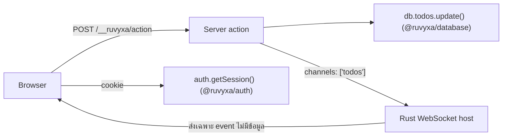

# แพ็กเกจทางการ: Database, Auth & Realtime

Ruvyxa มีแพ็กเกจ first-party สามตัวสำหรับจัดการ state ของแอปพลิเคชัน ทุกตัวเป็นทางเลือก (optional)
ติดตั้งเพิ่มได้และถอดออกได้ — ลบ import ออกแล้วระบบกลับสู่พฤติกรรมเดิมโดยไม่ต้อง migrate อะไร

| แพ็กเกจ            | ให้อะไร                                                                                | รันที่ไหน                            |
| ------------------ | -------------------------------------------------------------------------------------- | ------------------------------------ |
| `@ruvyxa/database` | API CRUD + transaction แบบ typed เดียว ครอบ Prisma, DynamoDB, หรือ adapter ที่เขียนเอง | Server เท่านั้น                      |
| `@ruvyxa/auth`     | Session, login แบบ credentials, OAuth (PKCE), magic link, WebAuthn, rate limiting      | Server (+ client เล็กๆ ฝั่ง browser) |
| `@ruvyxa/realtime` | อัปเดต UI สดผ่าน WebSocket native หลัง server action สำเร็จ                            | Self-hosted Node/Bun เท่านั้น        |

ติดตั้งเฉพาะที่ต้องใช้:

```bash
npm install @ruvyxa/database
npm install @ruvyxa/auth
npm install @ruvyxa/realtime
```

> **สำหรับมือใหม่** — สร้างแอปแรกไม่จำเป็นต้องใช้แพ็กเกจพวกนี้เลย เริ่มจาก page, loader, action
> ในบทก่อนหน้าให้คล่องก่อน แล้วค่อยหยิบมาใช้เมื่อต้องการฐานข้อมูล ระบบ login หรืออัปเดตแบบสด

---

## `@ruvyxa/database` — API เดียวครอบทุกฐานข้อมูล

### มีไว้ทำไม

แอปที่ใช้ข้อมูลมักเขียน glue ซ้ำๆ: ต่อ driver, ห่อ CRUD, validate input, จัดการ transaction
`createDatabase()` ให้ facade แบบ typed เดียว — page และ action ไม่ต้องรู้ว่าเบื้องหลังเป็น engine
อะไร

### เริ่มเร็ว (Prisma)

Prisma ครอบ PostgreSQL, MySQL, SQLite และ MongoDB:

```ts
// lib/db.ts — โมดูล server-only
import { PrismaClient } from '@prisma/client'
import { createDatabase, prismaAdapter } from '@ruvyxa/database'

interface Schema {
  todos: { id: string; title: string; done: boolean }
}

const prisma = new PrismaClient()
export const db = createDatabase<Schema>(prismaAdapter(prisma))
```

เรียกใช้จาก loader หรือ server action:

```ts
// app/todos/loader.ts
import { db } from '../../lib/db'

export default async function loader() {
  return { todos: await db.todos.findMany({ take: 50 }) }
}
```

Model delegate รองรับ `findMany`, `findFirst`, `findUnique`, `create`, `createMany`, `update`,
`updateMany`, `delete`, `deleteMany`, `count` และ `db.$transaction(async (tx) => { ... })` เมื่อ
adapter รองรับ transaction

### DynamoDB

DynamoDB ทำงานผ่าน transport ที่ระบุเอง — เวอร์ชัน AWS SDK เป็นสิทธิ์ของคุณ:

```ts
import { createDatabase, dynamoAdapter } from '@ruvyxa/database'

export const db = createDatabase<Schema>(
  dynamoAdapter({
    transport: myDynamoTransport, // ห่อ AWS SDK v2, v3 หรือ local emulator
    tables: { todos: 'app-todos' }, // model ที่ไม่ได้ map จะ fail ทันที (fail closed)
  }),
)
```

### ความปลอดภัยตั้งแต่ตอน build

เพิ่ม `databasePlugin()` เพื่อให้ production build ล้มเร็วเมื่อคอนฟิกผิด:

```ts
// ruvyxa.config.ts
import { databasePlugin } from '@ruvyxa/database'
import { config } from 'ruvyxa/config'

export default config({
  plugins: [databasePlugin({ requiredEnv: ['DATABASE_URL'] })],
})
```

- ไม่มี `DATABASE_URL` → build fail พร้อมข้อความชัดเจน แทนที่จะ crash ตอน runtime
- ตัวแปรฐานข้อมูลชื่อ `RUVYXA_PUBLIC_*` → ถูก reject เพราะ prefix นี้ถูกส่งไป browser
- import `@ruvyxa/database` จากโค้ดฝั่ง client → reject ด้วย `RUV1007` ตอน build

### ข้อผิดพลาดที่พบบ่อย

| ผิดยังไง                                  | เกิดอะไร                               | แก้ยังไง                                    |
| ----------------------------------------- | -------------------------------------- | ------------------------------------------- |
| import `lib/db.ts` จากไฟล์ `'use client'` | Build fail ด้วย `RUV1007`              | ดึงข้อมูลผ่าน loader, action หรือ API route |
| สร้าง client ใน `ruvyxa.config.ts`        | แต่ละ process ได้สำเนาของตัวเอง        | สร้างในโมดูล server-only ของแอป (`lib/`)    |
| ใช้ Dynamo model ที่ไม่ได้ map            | error `RUV3002` (fail closed ไม่ scan) | เพิ่ม model ใน `tables`                     |

---

## `@ruvyxa/auth` — session และ login flow

### ได้อะไรบ้าง

`createAuth(options)` คืน runtime แยกอิสระหนึ่งตัว:

- `plugin` — ลงทะเบียนใน `ruvyxa.config.ts` สำหรับ middleware แบบ self-hosted
- `handle(request)` — เรียกจาก API route (ใช้บน serverless ได้ด้วย)
- `login`, `getSession`, `logout` — เรียกตรงฝั่ง server

Session เป็น **opaque cookie** เก็บใน store ที่คุณเป็นเจ้าของ — ไม่มีปัญหาแบบ JWT, revoke ได้ทันที

### เริ่มเร็ว (credentials)

```ts
// lib/auth.ts — โมดูล server-only
import { createAuth, memoryAuthStore, memoryRateLimitStore } from '@ruvyxa/auth'

export const auth = createAuth({
  secret: process.env.AUTH_SECRET!, // อย่างน้อย 32 ตัวอักษร
  origin: 'https://app.example.com',
  store: memoryAuthStore({ development: true }), // production เปลี่ยนเป็น Redis/SQL
  rateLimitStore: memoryRateLimitStore({ development: true }),
  providers: {
    email: {
      type: 'credentials',
      async authorize(input) {
        const user = await findUserByEmail(String(input.email))
        return user && (await verifyPassword(user, String(input.password))) ? user : null
      },
    },
  },
})
```

ลงทะเบียน middleware:

```ts
// ruvyxa.config.ts
import { config } from 'ruvyxa/config'
import { auth } from './lib/auth'

export default config({ plugins: [auth.plugin] })
```

Browser คุยกับ endpoint `/__ruvyxa/auth/*` ผ่าน client ตัวเล็ก:

```ts
// component 'use client' ใดก็ได้
import { createAuthClient } from '@ruvyxa/auth/client'

const client = createAuthClient()
await client.login('email', { email, password })
const session = await client.session()
client.oauth('google', '/dashboard') // redirect ไป OAuth start endpoint
await client.logout()
```

### OAuth ในสามบรรทัด

Helper ของ Google และ GitHub ใส่ endpoint และ profile mapping ให้แล้ว:

```ts
import { github, google } from '@ruvyxa/auth'

providers: {
  google: google({ clientId: process.env.GOOGLE_ID!, clientSecret: process.env.GOOGLE_SECRET! }),
  github: github({ clientId: process.env.GITHUB_ID!, clientSecret: process.env.GITHUB_SECRET! }),
}
```

Key ของ provider ต้องตรงกับ id ของ helper (`google` ใต้ key `google`) ส่ง browser ไปที่
`/__ruvyxa/auth/oauth/google/start?returnTo=/dashboard` — Ruvyxa จัดการ PKCE, state, token exchange
และ redirect กลับอย่างปลอดภัยให้ทั้งหมด provider อื่นนอกจากนี้ให้ระบุ object
`{ type: 'oauth', id, authorizationUrl, tokenUrl, userInfoUrl, clientId, scopes, mapProfile }` เอง

Magic link และ WebAuthn ใช้รูปแบบเดียวกัน — คุณเขียน `send()` / `resolveUser()` สำหรับลิงก์อีเมล
หรือ delegate `options()` / `verify()` สำหรับ passkey ส่วน framework เป็นเจ้าของ endpoint flow,
การกัน replay และ rate limiting

### ข้อกำหนด production (ระบบเช็คให้)

Production build จะ **fail** ด้วย `RUV3105` เมื่อ store ของ session หรือ rate-limit ไม่ durable
Memory store บังคับใส่ `{ development: true }` เพื่อกันหลุดไป production โดยไม่ตั้งใจ เตรียม
implementation ของ `AuthStore` สี่เมธอด (`get`, `set`, `delete`, `take` แบบ atomic) บน Redis, SQL
หรือ KV พร้อม rate-limit store ที่มี `consume()` แบบ atomic

### โมเดลความปลอดภัยย่อหน้าเดียว

Endpoint ที่ unsafe บังคับ header `Origin` ตรงกับ canonical origin, body จำกัด 32 KiB แบบ stream,
key ของ session เป็น HMAC-SHA-256 — store หลุดก็ไม่เห็น token ดิบ, OAuth ใช้ PKCE S256 พร้อม state
ใช้ครั้งเดียวผูกกับ browser ที่เริ่ม flow, magic link ถูก consume แบบ atomic (`take`)
ใช้ได้ครั้งเดียว, rate limiting จงใจไม่เชื่อ `X-Forwarded-For`, access token ของ provider
ไม่มีทางถึง browser

### ตารางรหัส error

| Code      | ความหมาย                                               |
| --------- | ------------------------------------------------------ |
| `RUV3100` | ความผิดพลาดภายใน auth (ซ่อนรายละเอียดจาก client)       |
| `RUV3101` | request/credentials ไม่ถูกต้อง หรือ provider ไม่รู้จัก |
| `RUV3102` | โดน rate limit — มี `retry-after` ให้                  |
| `RUV3103` | OAuth state หรือ magic-link token หมดอายุ/ไม่ถูกต้อง   |
| `RUV3104` | OAuth provider ฝั่งต้นทางล้มเหลว                       |
| `RUV3105` | Production build แต่ store ไม่ durable                 |

---

## `@ruvyxa/realtime` — อัปเดตสดหลัง action

### วิธีคิด

คุณ **ไม่ต้องเขียนโค้ด WebSocket** — แค่ tag server action ด้วย channel ที่มันกระทบ เมื่อ action
สำเร็จ ทุก browser ที่ subscribe จะได้ event แจ้งเตือนเล็กๆ — ไม่ใช่ผลลัพธ์ของ action ไม่ใช่แถวจาก
ฐานข้อมูล — แล้ว browser ค่อย refetch ผ่าน loader ปกติ

### เปิด transport

```ts
// ruvyxa.config.ts
import { realtime } from '@ruvyxa/realtime'
import { config } from 'ruvyxa/config'

export default config({ plugins: [realtime()] })
```

### Tag action

```ts
// app/todos/action.ts
export const addTodo = action
  .realtime('todos')
  .input(todoSchema)
  .handler(async ({ input }) => db.todos.create({ data: input }))
```

### Subscribe ฝั่ง browser

```ts
// component 'use client'
import { createRealtimeClient } from '@ruvyxa/realtime/client'

const client = createRealtimeClient()
const unsubscribe = client.subscribe('todos', (event) => {
  // ยิงเฉพาะ channel 'todos' — หรือ event ฟื้นตัว { type: 'resync' }
  refetchTodos() // refetch ผ่าน loader ของคุณ
})
```

Client ต่อใหม่อัตโนมัติด้วย exponential backoff แบบมีขอบเขต ถ้า server ต้อง drop event ตอนโหลดสูง
จะได้ `{ type: 'resync' }` — ให้ถือว่า "refetch ทุกอย่างที่สนใจ"

### รันได้ที่ไหน

| Deployment                            | Native realtime              |
| ------------------------------------- | ---------------------------- |
| `ruvyxa dev`                          | ✅                           |
| Self-hosted Node/Bun (`ruvyxa start`) | ✅                           |
| Static / Vercel / Netlify / Edge      | ❌ build fail ด้วย `RUV3201` |

Fail ตอน **build** โดยตั้งใจ: แพลตฟอร์ม serverless ไม่มีเจ้าของ socket ถาวร plugin จึงไม่แกล้ง
ทำเป็นรองรับ หนึ่ง instance ส่งให้ connection ของตัวเอง — fan-out หลาย instance ต้องมี broker ภายนอก
ซึ่งตั้งใจไม่รวมในรุ่นนี้

### ขีดจำกัดที่ควรรู้

- 16 channel ต่อ connection และต่อ action; ชื่อ channel ยาว 1–128 ตัวจาก `A-Za-z0-9:._/-`
- path ของ realtime ห้ามชน route สงวนของ framework (`/__ruvyxa/hmr`, `/client`, `/action`, `/trace`)
  — จะ fail ตอน start พร้อมข้อความชัดเจนแทนการ crash
- `action.realtime()` ไม่ระบุ channel = broadcast บน `route:<pathname>` — จับคู่กับ
  `client.subscribeRoute(pathname)`

---

## สามแพ็กเกจทำงานร่วมกันยังไง



Mutation ทั่วไป: browser ที่ login แล้วเรียก server action → action เช็ค `auth.getSession()`,
เขียนผ่าน `db.*` และ tag `realtime('todos')` แจ้งทุกแท็บที่เปิดอยู่ → แต่ละแท็บ refetch ผ่าน loader
ทุกขั้นเป็น typed และทุก boundary ถูกบังคับตอน build

## บทถัดไป

- [Plugins](plugins.md) — เขียน middleware และ build hook ของตัวเอง
- [Server Actions](server-actions.md) — validation และ form ที่ใช้คู่กับแพ็กเกจพวกนี้
- [Deployment](deployment.md) — รายละเอียดความเข้ากันได้ของ adapter
- [สถาปัตยกรรมแพ็กเกจทางการ](../../architecture/official-plugins.md) — internals เต็ม, security
  invariants และ process ownership
