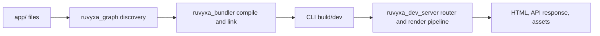

# บทนำ

> **เป้าหมายของ tutorial:** เลือกจุดเริ่มต้นที่เหมาะสมและเข้าใจแอปขนาดเล็กที่คุณจะสร้าง
> **เริ่มจาก:** [ดัชนีเอกสาร](README.md) **Checkpoint:** ยืนยันว่าเครื่องของคุณตรงตามข้อกำหนด
> แล้วจึงไปบท 2

Ruvyxa ออกแบบมาสำหรับ React application ที่ต้องการ file-system route, server rendering, static
output, server action, API route, plugin และ native build/dev pipeline โดยยังควบคุม deployment
target ได้ชัดเจน npm entry point แบบ public คือ `ruvyxa`; React helper อยู่ใน `@ruvyxa/react`;
framework primitive อยู่ใน `@ruvyxa/core` และถูก re-export จาก `ruvyxa`.

## สิ่งที่มี implementation อยู่จริง

route graph รู้จักไฟล์ page, layout, API route, loading, error และ not-found ภายใต้ application
directory ที่ตั้งค่าไว้ หน้าหนึ่งสามารถใช้ SSR, SSG, ISR, CSR หรือ PPR ได้ CLI เป็นเจ้าของการค้นหา
route, validation, build, serving, analysis และ parity check ส่วน application code ใช้ React ปกติและ
Web API `Request`/`Response`.



## ข้อกำหนดเบื้องต้น

การ **สร้างแอปด้วย Ruvyxa** ต้องการเพียง Node.js กับ package manager เท่านั้น compiler และ server
เขียนด้วย Rust ก็จริง แต่ถูก build มาให้แล้ว: `npm install ruvyxa` จะ resolve package
`@ruvyxa/cli-<platform>` ที่บรรจุ binary ของเครื่องคุณ จึงไม่ต้องติดตั้ง Rust toolchain

คู่มือนี้จะไม่ระบุเลขเวอร์ชันตายตัว เพราะเลขที่เขียนไว้จะล้าสมัยทันทีที่มี release ใหม่
ข้อกำหนดแต่ละข้อจึงชี้ไปยังไฟล์ที่ประกาศค่านั้นไว้ ซึ่งเป็นแหล่งที่ถูกต้องเสมอ

| สิ่งที่ต้องมี        | ประกาศไว้ที่                                                       |
| -------------------- | ------------------------------------------------------------------ |
| ขั้นต่ำของ Node.js   | `engines.node` ในทุก package ที่เผยแพร่ และใน project ที่สร้างขึ้น |
| React และ TypeScript | `dependencies` และ `devDependencies` ของ starter template          |
| package manager      | npm, pnpm, yarn หรือ bun ก็ได้ — project ที่สร้างขึ้นใช้ได้ทั้งหมด |

รัน `ruvyxa doctor` ใน project เพื่อดูเวอร์ชันที่ resolve ได้จริงบนเครื่องคุณ
และดูว่าตัวไหนต่ำกว่าขั้นต่ำ นอกจากนี้ project ต้องมี `package.json`, `ruvyxa.config.ts` และ
application directory (โดยทั่วไปคือ `app/`)

การ **พัฒนาตัว framework เอง** ต้องมี Rust toolchain (edition 2024 โดยขั้นต่ำอยู่ที่ `rust-version`
ใน `Cargo.toml` ของ workspace) และ pnpm รุ่นที่ pin ไว้ใน `packageManager` เพิ่มด้วย ดู
[การพัฒนาและการทดสอบ](12-development-testing.md)

> **ขอบเขต:** framework รองรับ runtime option `node`, `bun` และ `deno` ใน CLI/config Node ยังคงเป็น
> package prerequisite ที่ประกาศไว้; ติดตั้ง Bun หรือ Deno เฉพาะเมื่อเลือก runtime นั้น Deno local
> tooling จะรัน trusted project configuration และ plugin พร้อม permission ที่ต้องใช้
> (`-A --no-prompt`)

## ผลลัพธ์ขั้นต่ำ

```text
my-app/
├── app/
│   ├── layout.tsx
│   └── page.tsx
├── package.json
├── ruvyxa.config.ts
└── tsconfig.json
```

เริ่มที่ [สร้าง app แรก](02-create-your-first-app.md) และดูรายการ feature ที่มี source path
รองรับได้ที่ [ขอบเขตเอกสารและแหล่งข้อมูล](18-documentation-scope-and-sources.md).

**ก่อนหน้า:** [ดัชนีเอกสาร](README.md) · **ถัดไป:** [สร้าง app แรก](02-create-your-first-app.md)
