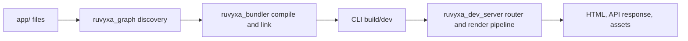

# บทนำ

> **เป้าหมายของ tutorial:** เลือกจุดเริ่มต้นที่เหมาะสมและเข้าใจแอปขนาดเล็กที่คุณจะสร้าง
> **เริ่มจาก:** [ดัชนีเอกสาร](README.md) **Checkpoint:** ยืนยันว่าเครื่องของคุณตรงตามข้อกำหนด
> แล้วจึงไปบท 2

Ruvyxa ออกแบบมาสำหรับ React application ที่ต้องการ file-system route, server rendering, static
output, server action, API route, plugin และ native build/dev pipeline โดยยังควบคุม deployment
target ได้ชัดเจน npm entry point แบบ public คือ `ruvyxa`; React helper อยู่ใน `@ruvyxa/react`;
framework primitive อยู่ใน `@ruvyxa/core` และถูก re-export จาก `ruvyxa`.

## สิ่งที่มี implementation อยู่จริง

route graph รู้จักไฟล์ page, layout, API route, loading, error และ not-found ภายใต้ application
directory ที่ตั้งค่าไว้ หน้าหนึ่งสามารถใช้ SSR, SSG, ISR, CSR หรือ PPR ได้ CLI เป็นเจ้าของการค้นหา
route, validation, build, serving, analysis และ parity check ส่วน application code ใช้ React ปกติและ
Web API `Request`/`Response`.



## ข้อกำหนดเบื้องต้น

- root และ JavaScript package ที่เผยแพร่ระบุ Node.js `>=24.19.0`
- project ที่ generator สร้างระบุ Node `>=24.19.0` และติดตั้ง/รันด้วย npm ได้ ส่วน monorepo ใช้ pnpm
  `11.21.0`; เรื่องนี้เกี่ยวกับผู้พัฒนา framework เท่านั้น
- template ใช้ React และ React DOM `19.2.8`
- project ต้องมี `package.json`, `ruvyxa.config.ts` และ application directory (โดยทั่วไปคือ `app/`)

> **ขอบเขต:** framework รองรับ runtime option `node`, `bun` และ `deno` ใน CLI/config Node ยังคงเป็น
> package prerequisite ที่ประกาศไว้; ติดตั้ง Bun หรือ Deno เฉพาะเมื่อเลือก runtime นั้น Deno local
> tooling จะรัน trusted project configuration และ plugin พร้อม permission ที่ต้องใช้
> (`-A --no-prompt`)

## ผลลัพธ์ขั้นต่ำ

```text
my-app/
├── app/
│   ├── layout.tsx
│   └── page.tsx
├── package.json
├── ruvyxa.config.ts
└── tsconfig.json
```

เริ่มที่ [สร้าง app แรก](02-create-your-first-app.md) และดูรายการ feature ที่มี source path
รองรับได้ที่ [ขอบเขตเอกสารและแหล่งข้อมูล](18-documentation-scope-and-sources.md).

**ก่อนหน้า:** [ดัชนีเอกสาร](README.md) · **ถัดไป:** [สร้าง app แรก](02-create-your-first-app.md)
