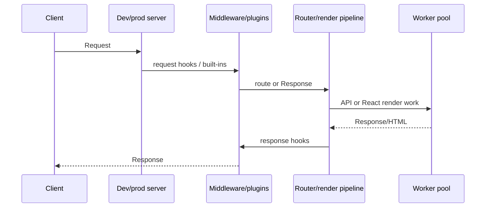

# Architecture

> **เป้าหมายของ tutorial:** ตามรอย request และ build อย่างละหนึ่งครั้ง เพื่อให้เหตุผลกับขอบเขตของ
> framework ได้ **เริ่มจาก:** application workflow ใน [CLI](10-cli.md) **Checkpoint:** อธิบายได้ว่า
> layer ใดค้นหา route, build module และ render response

## Boundary map

```mermaid
flowchart TB
  CLI[ruvyxa_cli] --> GRAPH[ruvyxa_graph]
  CLI --> BUNDLER[ruvyxa_bundler]
  CLI --> SERVER[ruvyxa_dev_server]
  SERVER --> MW[ruvyxa_middleware]
  CLI --> DIAG[ruvyxa_diagnostics]
  CLI --> TUI[ruvyxa_tui]
  SERVER --> TUI
  BUNDLER --> RT[packages/ruvyxa runtime]
  APP[Application + plugins] --> CLI
  APP --> REACT[@ruvyxa/react]
  APP --> CORE[@ruvyxa/core]
```

`ruvyxa_cli` เป็นเจ้าของ command, config loading, build output, prerendering, artifact caching,
adapter selection และ execution ฝั่ง package `ruvyxa_graph` ค้นหาและ validate file-system route และ
rendering intent `ruvyxa_bundler` compile TypeScript/JSX, resolve/link module, split chunk, minify,
เขียน source map, จัดการ style, cache แบบ incremental และตรวจ server/client boundary
`ruvyxa_dev_server` ให้ Axum serving, routing, HMR, worker pool, render cache/pipeline, static
asset, i18n, image handling และ plugin bridge/head integration

`ruvyxa_middleware` เป็นเจ้าของ built-in middleware configuration/stack และ plugin host
`ruvyxa_diagnostics` เก็บ diagnostic reporting ที่ใช้ร่วมกัน ส่วน `ruvyxa_tui` เป็นเจ้าของ primitive
สำหรับ terminal layout, progress, mascot และ theme ที่ CLI กับ command output ฝั่ง server ใช้ร่วมกัน
JavaScript runtime ใน `packages/ruvyxa/runtime/` ทำ rendering/compiler/worker/adapter ณ boundary ที่
Rust เรียก TypeScript/React

## Request lifecycle



request และ response hook แทนค่าหรือ continue ได้ plugin response middleware buffer TypeScript
response ภายใต้ `security.pluginLimit` จึงต้องกำหนดขนาดและทดสอบ response streaming ขนาดใหญ่ให้รอบคอบ
worker setting เป็น process control ไม่ใช่ dependency-injection container; ไม่พบหลักฐานของ public DI
API ทั่วไป, queue system, scheduler หรือ framework-managed event bus

## ขอบเขตของ worker pool

pool แยกเจ้าของความรับผิดชอบไว้สามส่วนอย่างตั้งใจ:

- `crates/ruvyxa_dev_server/src/worker_pool.rs` เป็นเจ้าของการสร้าง process, การเลือก worker
  ที่มีงานค้างน้อยที่สุด, การจับคู่ request/response, timeout, replacement, streaming backpressure
  และการปิด process
- `packages/ruvyxa/runtime/worker-pool.mjs` เป็นเจ้าของ NDJSON dispatcher, compilation/render cache,
  การรัน request, invalidation และ worker health snapshot
- `packages/ruvyxa/runtime/worker-admission.mjs` เป็นเจ้าของเฉพาะ bounded FIFO admission state:
  active slot, queued waiter, overload count, release และ close

เมื่อแก้ boundary นี้ต้องรักษา invariant ต่อไปนี้: `ping` และ `invalidate` ไม่เข้าคิว render; ทุก
acquire ที่สำเร็จต้องมี release เพียงหนึ่งครั้ง; งานที่รอต้องเป็น FIFO; queue overflow คืน
`RUV1705`; การปิด admission ต้อง settle งานในคิว; และ stdout มีเฉพาะ NDJSON response เท่านั้น local
module ที่ worker import เป็นทั้งเนื้อหาใน package และ input ของ prerender cache ดู
[ตารางการเปลี่ยน worker pool](12-development-testing.md#worker-pool-change-matrix)
ก่อนแก้ไฟล์เหล่านี้

## HMR protocol

`HmrTracker` เก็บ reverse dependency map แยกตาม lane — manifest, server, client และ action — ดังนั้น
การแก้ไขฝั่ง server เพียงอย่างเดียวจะไม่ invalidate งานฝั่ง client ที่ไม่ได้พึ่งพามันเลย และการ
rebuild server action จะไม่สามารถระงับ client update ของ route เดียวกันได้ WebSocket wire protocol
(`ruvyxa.hmr`, `protocolVersion: 1`) มี version กำกับ: ทุก message มี `sequence` ที่เพิ่มขึ้นเสมอ
และ browser client ที่ inline มากับหน้า (ไม่ใช่ bundle แยก) จะทิ้ง message ที่ sequence เคยถูก apply
ไปแล้ว ทำให้ update ที่ถูกแทนที่ไปแล้วไม่มีทางมาถึงทีหลัง message เป็นหนึ่งใน `partial` (พร้อม
`kind` เป็น `css`, `client-boundary` หรือ `server-route`), `restart` หรือ `issues` การอัปเดต CSS
จะแทนที่ stylesheet ที่เกี่ยวข้องในตำแหน่งเดิมแทนการ reload ส่วนสิ่งที่ client
พิสูจน์ความปลอดภัยไม่ได้ — รวมถึง client-boundary update ใดก็ตามที่ runtime ยังไม่ได้ลงทะเบียน
refresh handler ไว้ — จะ fallback ไปที่ `location.reload()` ซึ่งยังคงถูกต้องไม่ใช่ความล้มเหลว

## Build lifecycle

build validate config และ graph, compile route/client code, รัน build plugin hook, prerender
SSG/ISR/PPR route ที่เข้าเกณฑ์, สร้าง site discovery file, บันทึก manifest และ commit staging output
เข้าที่ artifact cache fingerprint input ที่เกี่ยวข้องและ reuse final prerendered HTML ได้เมื่อเปิด
`build.prerenderCache` (ค่าเริ่มต้น) static adapter ต้องการ prerendered page ที่สร้างแล้ว

bundler ยัง persist typed artifact task graph สำหรับ computation ขั้น source, resolve, transform,
analysis, chunk-plan, emit, source-map และ manifest โดย key รวม evaluated configuration namespace
และ semantic input ส่วน dependency edge ระบุงานที่ได้รับผลกระทบอย่างชัดเจน bytes ของ artifact ยังมี
cache แบบ content-addressed เดิมเป็นเจ้าของ ดังนั้น metadata ของ graph เพียงอย่างเดียวจะไม่ถูก
ใช้เป็น output record ที่เสียหาย ถูกยกเลิก หรือเข้ากันไม่ได้จะ rebuild ตามปกติ และ publish แบบ
atomic หลังทำงานเสร็จเท่านั้น เมื่อต้องวิเคราะห์ release rollback ให้ตั้ง
`RUVYXA_DISABLE_ARTIFACT_CACHE=1`; ค่านี้ bypass task graph โดยไม่ปิด correctness path หรือเปลี่ยน
artifact ที่ emit

build cache ใช้ memory-pressure policy แบบ soft/hard ร่วมกัน เมื่อเกิด pressure ระบบจะทิ้ง resolver
derivation ก่อน ตามด้วย persisted artifact metadata และ compiler memory ที่เป็น LRU ส่วน source
snapshot และ dependency closure ของ artifact ที่กำลังทำงานจะถูก pin ไว้ hard limit เริ่มต้น ของ
native build cache คือ 256 MiB และเปลี่ยนได้ด้วย `RUVYXA_BUILD_CACHE_MEMORY_MB` การ evict
เปลี่ยนได้เฉพาะ latency โดย test บังคับให้ budget ขนาด 1 byte ต้อง emit output เดียวกับ budget ใหญ่

**ก่อนหน้า:** [CLI reference](10-cli.md) · **ถัดไป:**
[Development และ testing](12-development-testing.md)
