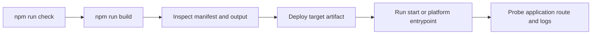

# Deploy, run และ operate ใน production

> **เป้าหมายของ tutorial:** เปลี่ยน build ที่ตรวจแล้วเป็น artifact สำหรับ deploy
> พร้อมแผนปฏิบัติการที่ชัดเจน **เริ่มจาก:** หลักฐานที่เก็บได้ใน
> [Observability และ performance](14-observability-performance.md) **Checkpoint:** ทำคำสั่งก่อน
> deploy ให้ครบ และ probe health route หนึ่งรายการที่แอปคุณเป็นเจ้าของ

## Build และเลือก target

```bash
npm run build
# หรือเลือก target/adapter โดยไม่แก้ config
npm run build -- --target static
npm run build -- --adapter node
```

target ที่ยืนยันแล้วคือ `node`, `bun`, `deno`, `edge` และ `static` adapter selection รับ Node, Bun,
Deno, static, Vercel, Netlify, Cloudflare, Railway, Render, Firebase, AWS หรือชื่อ adapter package
adapter เป็น build-output contract; ตรวจ package ของ adapter ที่เลือกก่อนสมมติ platform
configuration, health check หรือ scaling semantics

## ลำดับ operations



ก่อน deploy ให้รัน `npm run check`, `npm run build` และ `npm run test:parity`; แล้วตรวจ
manifest/output และเรียก health route ที่ application ของคุณทำเอง (`api` template มี
`app/api/health/route.ts`) framework ไม่ได้สำรองหรือ implement health/readiness endpoint แบบสากล

## Production checklist

- ตั้ง `site.url` หรือ `RUVYXA_SITE_URL` แบบ private เป็น canonical origin จริงก่อนพึ่ง generated
  sitemap URL preview-only Vercel/Netlify URL จะไม่ถูกเลือกเป็น canonical origin โดยตั้งใจ
- ตั้ง server host/port ชัดเจนเมื่อคุณรัน Node/Bun/Deno process เองเท่านั้น ให้ managed adapter
  เป็นเจ้าของ generated entrypoint
- เก็บ application state นอก process memory core cache และ auth memory store เป็น local ต่อ
  instance; ให้ shared database/cache/session infrastructure เมื่อจำเป็น
- ตั้ง log collection สำหรับ structured record และ redact ที่ sink เชื่อม infrastructure
  metric/alert เพราะ repository ไม่มี built-in alert manager, backup service, queue worker หรือ
  scheduler
- ใช้ immutable build artifact และ platform rollback mechanism source แสดง staging output
  ที่ย้ายเข้าที่หลัง build สำเร็จ แต่ไม่ implement remote release orchestration หรือ database
  rollback

## build ที่ deploy แล้วให้บริการอะไรบ้าง

build artifact รัน request pipeline เดียวกับ `ruvyxa start` ไม่ใช่ชุดที่ถูกลดทอน:

| ความสามารถ                                                          | `dev` / `start` | build ที่ deploy แล้ว |
| ------------------------------------------------------------------- | --------------- | --------------------- |
| page route และ API route                                            | ได้             | ได้                   |
| server action (`POST /__ruvyxa/action`)                             | ได้             | ได้                   |
| plugin `http.onRequest` / `onResponse` / `route`                    | ได้             | ได้                   |
| `@ruvyxa/auth` (สร้างบน plugin HTTP hook)                           | ได้             | ได้                   |
| on-demand image (`/__ruvyxa/image`)                                 | ได้             | ขึ้นกับ adapter       |
| native realtime และ presence                                        | ได้             | ไม่ได้                |
| `security.apiLimit`, `security.headers`, `security.trustedProxyIps` | ได้             | ได้                   |

server action และ plugin HTTP hook ถูก compile เข้า function artifact จาก `ruvyxa.config`
โปรเจกต์ที่ใช้ทั้งสองอย่างจึง deploy ได้โดยไม่ต้องตั้งค่าเพิ่ม ส่วน realtime และ presence ต้องการ
socket upgrade ซึ่ง build artifact ทำไม่ได้; `ruvyxa build` จะพิมพ์ `RUV2205` พร้อมระบุ endpoint
ที่จะหายไป และ `ruvyxa check` รายงานเรื่องเดียวกันในแถว capability parity ให้ serve
โปรเจกต์เหล่านั้นด้วย `ruvyxa start`

การเลือก adapter ที่ให้บริการสิ่งที่โปรเจกต์ใช้ไม่ได้ จะทำให้ build ล้มเหลว แทนที่จะ deploy
เว็บที่ตอบ 404: static adapter ที่มี server action หรือ plugin HTTP route จะรายงาน `RUV2204`

## build output คือสัญญา

build ชุดเดียว deploy ได้ทุกที่เพราะ build อธิบายตัวเองไว้ — `ruvyxa build` จะเขียนส่วน `deploy`
ลงใน `manifest.json`: คำอธิบายที่มีเลขเวอร์ชันและไม่ผูกกับผู้ให้บริการรายใด ว่า build สร้างอะไรออกมา
และต้องเสิร์ฟอย่างไร adapter ทุกตัวอ่านส่วนนี้แทนการเดาเอาเองจาก route metadata
และอะไรก็ตามที่คุณวางไว้หน้า build ก็อ่านได้เหมือนกัน

ที่เป็นส่วนหนึ่งของไฟล์เดิม ไม่ใช่ไฟล์แยก เพราะต้องการให้ manifest เดียวอธิบาย build ทั้งหมด
ส่วนสำเนาที่ถูกคัดลอกเข้าไปในโฟลเดอร์ฟังก์ชันจะถูกตัดส่วนนี้ออก — "เสิร์ฟอย่างไร" เป็นคำถามตอน build
ฟังก์ชันที่กำลังรันอยู่ไม่ได้ใช้คำตอบนั้น

```jsonc
// .ruvyxa/manifest.json
{
  "appDir": "app",
  "routes": [/* the route graph, unchanged */],
  "deploy": {
    "version": 1,
    "framework": "ruvyxa",
    "buildId": "…", // derived from the emitted output, not a timestamp
    "directories": { "client": "client", "assets": "assets", "prerender": "prerender" },
    "routes": [
      {
        "path": "/",
        "serve": "static", // answerable from a file
        "strategy": "ssg",
        "document": "index.html",
        "cacheControl": "public, max-age=0, must-revalidate",
      },
      {
        "path": "/cached",
        "serve": "function", // must reach the server
        "strategy": "isr",
        "revalidate": 60,
        "cacheControl": "public, max-age=0, s-maxage=60, stale-while-revalidate=31535940",
      },
    ],
    "staticPaths": ["/"],
    "functionPaths": ["/cached", "/api/health"],
    "headers": [
      { "source": "/__ruvyxa/client/(.*)", "headers": { "cache-control": "…, immutable" } },
    ],
    "notFound": { "status": 404, "document": "404.html" },
  },
}
```

สามข้อที่ควรรู้ แม้จะไม่เคยเปิดไฟล์นี้เลย:

- **static กับ dynamic ถูกแยกให้แล้ว** `serve: "static"` แปลว่า CDN ตอบ URL นั้นจากไฟล์ได้ ส่วน
  `serve: "function"` แปลว่าคำขอต้องวิ่งถึงเซิร์ฟเวอร์ หน้า ISR/PPR เป็น `function`
  เสมอแม้จะมีเอกสาร พร้อมอยู่ — โฮสต์ที่ตอบจากไฟล์จะเสิร์ฟภาพนิ่งตอน build ไปตลอดกาล
  และไม่มีวันเรียกโค้ดที่ทำ revalidate
- **`buildId` มาจากผลลัพธ์ ไม่ใช่แสตมป์** เป็นแฮชของสิ่งที่ emit ออกมา ซอร์สเดิมจึงได้ id เดิม
  และผลลัพธ์ที่เปลี่ยนก็เก็บ id เดิมไว้ไม่ได้ นั่นคือเหตุผลที่มันอยู่ใน build ที่ reproducible ได้
- **`version` คือจุดที่ยอมปฏิเสธ** adapter ที่เขียนตามเวอร์ชัน 1 ใช้ได้เรื่อย ๆ เมื่อมีการเพิ่มฟิลด์
  แต่ถ้าความหมายของฟิลด์เดิมเปลี่ยน เวอร์ชันจะขยับ และ adapter รุ่นเก่าจะปฏิเสธ build
  แทนที่จะอ่านผิด

`404.html` ในโฟลเดอร์ prerender ก็แนวคิดเดียวกัน ถ้าโปรเจกต์มี `app/not-found.tsx` build จะเรนเดอร์
ไว้หนึ่งครั้งพร้อม root layout และ stylesheet ของคุณ: static host เสิร์ฟไฟล์นี้ให้ URL ที่ไม่มี
route โดยไม่ต้องตั้งค่าอะไร ส่วน build ที่มีฟังก์ชันก็พกไบต์ชุดเดียวกันไปตอบเอง

## Reproducible build

source เดิมกับ config เดิม จะได้ output เป็น byte เดิมเสมอ ไม่ว่ารันบนเครื่องไหน นี่เป็นคุณสมบัติที่
Ruvyxa **บังคับ** ไว้ ไม่ใช่แค่หวังว่าจะเป็น:

- `localeCompare` และการแปลงตัวพิมพ์ที่ขึ้นกับ locale (`toLocaleLowerCase`, `toLocaleUpperCase`)
  ถูกแบนด้วย lint เพราะทั้งคู่ตอบตาม ICU locale ของเครื่อง การเรียงลำดับใช้ comparator ที่ระบุชัดแทน
- การ match route, การกำหนดชนิดไฟล์ static และการตรวจความปลอดภัยของ prerender path ฝั่ง Rust และ
  JavaScript ถูกผูกไว้ด้วย conformance fixture ร่วมกัน สองภาษาจึงไม่มีทางเลื่อนออกจากกัน
- ตัวตัดสิน cache identity คือ content hash ไม่ใช่ timestamp

ตรวจกับโปรเจกต์ของคุณเองได้:

```bash
pnpm verify:reproducible --root path/to/project
```

คำสั่งนี้ build จากศูนย์สองรอบ แล้วเทียบทุกไฟล์ที่ออกมา พร้อมแยกประเภทความต่างตามความหมาย:

- **โค้ดที่ emit ออกมาต่างกัน** = ข้อบกพร่อง และทำให้ check ไม่ผ่าน แปลว่ามีบางอย่างใน build ขึ้นกับ
  เวลาจริง, ลำดับการวนซ้ำ, ค่าสุ่ม, absolute path หรือ locale ของเครื่อง
- **Build telemetry** — `createdAtUnix` กับ `timing` ใน `build.json` และตัวนับ cache ใน
  `client-report.json` ที่ `ruvyxa bench` อ่าน — เป็นข้อมูลว่า build _ทำงานอย่างไร_ จึงต่างกันได้
  ตามธรรมชาติ รายงานให้ทราบแต่ไม่ทำให้ fail
- **Prerendered HTML ต่างกัน** เกือบทุกครั้งเกิดจากหน้าเว็บของคุณเอง render นาฬิกาหรือค่าสุ่ม Ruvyxa
  แยกกรณีนี้จากบั๊กไม่ได้ จึงรายงานไว้ให้คุณตัดสิน

ใส่ `--strict` เพื่อให้ fail ทั้งสามประเภท ซึ่งเหมาะกับตอนที่ต้องการยืนยันว่า artifact ที่ deploy
ตรงกับ commit ที่ระบุ

## คำตอบที่ดูเหมือนบั๊ก แต่ตั้งใจ

สี่กรณีนี้เป็นพฤติกรรมที่ตั้งใจ และทุกกรณีเคยถูกแจ้งว่าเป็นบั๊กโดยคนที่ทดสอบ deployment
ด้วยสคริปต์แทนเบราว์เซอร์

**URL ที่มี `%2F` จะได้ `400` ไม่ใช่การ route** `/blog/a%2Fb` กับ `/blog/a/b` เป็นคนละคำขอ ถ้า
router ถอดรหัสอันแรกให้กลายเป็นอันที่สอง ก็เท่ากับปล่อยให้ตัวคั่นที่ถูกเข้ารหัสข้ามขอบเขต path
ที่มันไม่เคยได้รับอนุญาต Ruvyxa จึงปฏิเสธคำขอแทนการเลือกตีความเอง ถ้าต้องส่งค่าที่มี slash ให้ใส่ใน
query parameter หรือใช้ catch-all segment

**server action ที่ POST มาโดยไม่มี header `Origin` จะได้ `403`** การตรวจนี้คือการป้องกัน CSRF
และมันจะ fail closed: คำขอที่ไม่มีทั้ง `Origin` และ `sec-fetch-site: same-origin`
พิสูจน์ไม่ได้ว่ามาจากเว็บของคุณเอง จึงถูกปฏิเสธ เบราว์เซอร์ทุกตัวส่งอย่างใดอย่างหนึ่งเสมอตอน POST
ข้ามเอกสาร แต่ `curl` ไม่ส่งสักอย่าง เวลาเรียก action ด้วยมือให้เพิ่ม
`-H "Origin: https://your-host"` หรือถ้าตั้งใจให้ client ที่ไม่ใช่เบราว์เซอร์เรียกได้ ให้ตั้ง
`security.sameOrigin: false`

**สั่ง `ruvyxa build` ซ้ำบน output เดิมขณะที่ตัวแรกยังทำงานอยู่จะล้มเหลว** build จะจับ lock
บนโฟลเดอร์ output ของมัน build สองตัวที่เขียนโฟลเดอร์เดียวกันจะได้ผลลัพธ์ที่ปนกันของทั้งคู่
และผลลัพธ์ที่ปนกันแล้วสตาร์ตขึ้นได้นั้นแย่กว่า build ที่ปฏิเสธไปเลย ให้รอ หรือ build ไปที่
`--out-dir` อื่น

**Node ขึ้น `DEP0190` ตอนที่เซิร์ฟเวอร์ standalone สร้าง subprocess** ข้อความนี้มาจาก Node เอง
ไม่ใช่จาก Ruvyxa และชี้ไปที่รูปแบบการ spawn ที่ถูก deprecate ซึ่ง dependency ตัวหนึ่งในสายใช้อยู่
เป็นแค่ notice ไม่ใช่ error และไม่มีอะไรใน deployment ทำงานผิดเพราะมัน

## Platform limit

native realtime ต้องเป็น long-lived Node/Bun build; Deno รองรับ server route ครบชุดแต่ host native
realtime ไม่ได้ static adapter ต้องมี prerendered page และ render SSR โดยพลการตอน runtime ไม่ได้
container, Kubernetes, load balancer, backup/recovery, high availability และ provider-specific
configuration ไม่ได้กำหนดโดย repository นี้; เลือกและบันทึกไว้ใน deployment environment ของคุณ

สำหรับ artifact ที่แน่นอนและ handoff command ที่ยืนยันแล้วของ first-party adapter ทุกตัว ให้ไปต่อที่
[คู่มือ platform adapter](20-platform-adapter-guide.md) หน้านี้แยก generated provider file ออกจาก
provider-owned setup เพื่อให้คำสั่ง deploy ถูกต้องตาม implementation

**ก่อนหน้า:** [Observability และ performance](14-observability-performance.md) · **ถัดไป:**
[Troubleshooting และ compatibility เมื่ออัปเกรด](16-troubleshooting-upgrades.md)
