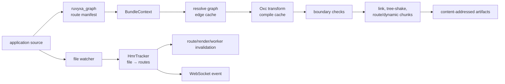
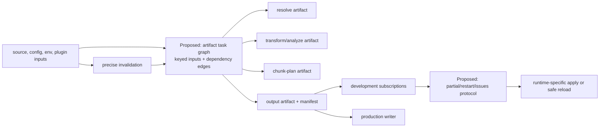

# Ruvyxa Modernization Roadmap: Turbopack and Next.js

> **Status:** architecture proposal, not an implementation commitment. **Evidence date:**
> 2026-08-15. **Reference:** the local Next.js canary snapshot supplied for this review, including
> its `turbopack/` workspace.

## Decision summary

Ruvyxa should adopt the _incremental-computation model_ behind Turbopack, not copy Turbopack or
attempt a feature-for-feature Next.js clone. The highest-leverage deficiency observed in the bundler
path is that Ruvyxa caches compiler and resolved-edge artifacts, while Turbopack tracks dependencies
between computations and propagates invalidation through that task graph. The first approved
implementation should therefore be a small, Ruvyxa-owned artifact task graph with measured
correctness and latency gates.

React Server Components (RSC), Flight, Cache Components, and server fast refresh are separate
product/runtime decisions. They cannot safely be treated as bundler-only work: they alter React
rendering, action transport, manifests, development protocol, and adapter contracts.

This document does **not** assert complete parity with all Next.js canary features. That scope is
not measurable from a selective architecture audit and would conflict with Ruvyxa's deliberate
contracts in places. It records what was inspected, the most material gaps, and a safe path to
reduce them.

## Scope and evidence

- **Pass:** Full. The user requested a framework-wide comparison covering the bundler, development
  server, and runtime capabilities. Staying at a bundler-only pass would miss the coupled HMR and
  rendering contracts.
- **Ruvyxa inspected:** `ARCHITECTURE.md`;
  `crates/ruvyxa_bundler/src/{lib,context,incremental,cache,hooks,types}.rs`;
  `crates/ruvyxa_dev_server/src/{hmr_tracker,html_document,lib,worker_pool}.rs`;
  `crates/ruvyxa_diagnostics/src/lib.rs`; build/config call sites; and current docs/test inventory.
- **Reference inspected:** Next.js workspace configuration; Turbo Tasks README and public API;
  `turbopack-core` asset/task code; Turbopack HMR protocol; Turbopack persistence; and Next's
  Turbopack dev/build integration and RSC/cache/instrumentation paths.
- **Inspection limit:** the reference snapshot was read as source evidence, not built or
  benchmarked. No claim here is a current upstream release guarantee or a performance comparison.

## Confirmed Ruvyxa baseline

| Capability                               | Observed evidence                                                                                                                 | Status  |
| ---------------------------------------- | --------------------------------------------------------------------------------------------------------------------------------- | ------- |
| Rust/Oxc route bundling                  | `ruvyxa_bundler/src/lib.rs` resolves, compiles, checks boundaries, links, tree-shakes, and emits output.                          | Present |
| Content-addressed compiler cache         | `cache.rs` keys compilation by source, JSX mode/runtime, compiler version, and namespace.                                         | Present |
| Persistent resolved-edge reuse           | `incremental.rs` fingerprints source and persists dependency edges plus aliases.                                                  | Present |
| Route-oriented shared and dynamic chunks | `lib.rs`, `chunking.rs`, and `types.rs` plan dynamic imports and shared-route output.                                             | Present |
| Build-hook boundary                      | `hooks.rs` supports ordered resolve, load, transform, and content hooks; the current design installs at most one TypeScript host. | Present |
| Selective development invalidation       | `hmr_tracker.rs` maintains file-to-route reverse dependencies, separately for manifest, server, client, and action lanes.         | Present |
| Structured framework diagnostics         | `ruvyxa_diagnostics/src/lib.rs` carries codes, spans, import chains, suggested fixes, affected routes, and SARIF output.          | Present |
| Broad lifecycle tests                    | Ruvyxa exposes `bench` and `test:parity`; the bundler has 269 Rust unit-test markers in the inspected sources.                    | Present |

## Relevant reference strengths

| Reference capability               | Direct evidence in supplied snapshot                                                                                                    | What is useful to learn                                                                                                                                         |
| ---------------------------------- | --------------------------------------------------------------------------------------------------------------------------------------- | --------------------------------------------------------------------------------------------------------------------------------------------------------------- |
| Computation task graph             | `turbopack/crates/turbo-tasks/README.md`, `src/lib.rs`                                                                                  | A function invocation is a memoized task. Read value cells form dependency edges; an input change invalidates and recomputes only affected tasks.               |
| Typed, composable assets           | `turbopack/crates/turbopack-core/src/asset.rs`                                                                                          | Sources, transforms, content, hashes, and output assets are values in the same dependency model.                                                                |
| Persistent task storage            | `turbo-tasks-backend` and `turbo-persistence`                                                                                           | Persistence, version handling, compaction, and eviction are explicit runtime concerns, rather than side effects of individual compiler caches.                  |
| Subscription-based HMR             | `turbopack-ecmascript-hmr-protocol/src/lib.rs`; Next `hot-reloader-turbopack.ts`                                                        | Updates can be `partial`, `restart`, `issues`, or `not-found`, tied to a resource subscription. Server HMR also has a conservative full re-evaluation fallback. |
| Whole-framework integration        | Next `turbopack-utils.ts` and `build/turbopack-build/impl.ts`                                                                           | Entry points, manifests, diagnostics, routes, cache, and development subscriptions are coordinated at one integration boundary.                                 |
| RSC/caching/observability platform | Next `build/create-compiler-aliases.ts`, `server/app-render/*`, and source searches for `use cache`, instrumentation, and OpenTelemetry | These are integrated runtime features with compiler aliases, manifests, request state, and development tooling—not isolated compiler transforms.                |

## Architecture map

### Confirmed current Ruvyxa flow



`BundleContext` correctly shares caches across a build batch. However, its persistent graph cache
reuses resolved edges; it does not model compiler, analysis, chunk-plan, emission, and runtime
outputs as dependent computations in one invalidation graph.

### Proposed target boundary



The proposal keeps route discovery in `ruvyxa_graph`, compilation policy in `ruvyxa_bundler`, and
HTTP/process ownership in `ruvyxa_dev_server`. It introduces no generic task engine API for
application code.

## Evidence-backed findings

### F-01 — Incrementality stops at cached artifacts, not dependent computations

- **Observation:** Ruvyxa persists compile output and resolution edges (`cache.rs`,
  `incremental.rs`) and shares them in `BundleContext`. Turbopack's task model tracks dependencies
  between memoized computations and propagates invalidation bottom-up (`turbo-tasks/README.md`).
- **Impact:** A change that leaves source text unchanged but changes a relevant build input—or that
  affects a later-stage artifact—has no single dependency contract covering resolution, transform,
  chunk planning, emission, and dev subscriptions. New incremental work must coordinate several
  caches and invalidators manually.
- **Severity:** High. **Confidence:** Direct. **Verify first:** No.
- **Smallest safe correction:** **Proposed; requires approval.** Add an internal artifact-task
  layer, initially for resolver → transform → chunk-plan → emit. Use explicit task keys and input
  fingerprints, dependency edges, cancellation, and observability. Reuse existing cache files as
  storage adapters during migration; do not replace every cache in one change.

### F-02 — HMR classification is more precise than browser application

- **Observation:** `HmrTracker` differentiates CSS, component, and full-reload events, and the
  server sends paths and affected routes (`hmr_tracker.rs`, `ruvyxa_dev_server/src/lib.rs`). The
  inline browser client in `html_document.rs` parses every event and unconditionally executes
  `location.reload()`.
- **Impact:** The reverse dependency work reduces server invalidation, but browser state is still
  lost for every accepted update. The `component-update` event does not yet deliver React Fast
  Refresh or a module/chunk patch.
- **Severity:** High. **Confidence:** Direct. **Verify first:** No.
- **Smallest safe correction:** **Proposed; requires approval.** Define a versioned HMR protocol
  with `partial`, `restart`, and `issues` messages. Start with CSS replacement and a guarded
  component runtime; retain reload as the mandatory fallback when boundaries, exports, or runtime
  state cannot be proven safe.

### F-03 — RSC/Flight is a product capability gap, not a local bundler task

- **Observation:** Next wires RSC aliases, Flight manifests, server-action support, and RSC HMR into
  build and app-render paths. No equivalent RSC/Flight execution path was observed in the inspected
  Ruvyxa bundler, development-server, runtime, or public-package surfaces; Ruvyxa's current bundle
  targets are Client, SSR, and Edge (`types.rs`).
- **Impact:** Ruvyxa cannot claim Next App Router compatibility or the associated server-component
  payload and segment-cache behavior from this evidence. A partial compiler-only adoption would risk
  mismatched client references, action serialization, and adapter behavior.
- **Severity:** High. **Confidence:** Inferred. **Verify first:** Yes—confirm desired React and
  deployment support matrix before designing a public API.
- **Phase 2 decision:** Deliver this only as a complete production platform: client/server
  manifests, Flight transport, action security, cache semantics, diagnostics, and adapter
  conformance ship together. Do not expose a partial compatibility layer.

### F-04 — Cache Components require an explicit cache contract

- **Observation:** Next's source has a `use cache` system coupled to request/work stores and client
  segment caches. Ruvyxa has route revalidation and render/artifact caching, but no equivalent
  directive-level cache contract was observed in the inspected public configuration or runtime
  paths.
- **Impact:** Adopting a directive by syntax alone would create ambiguous key, lifetime, tag,
  invalidation, serialization, and deployment semantics.
- **Severity:** Medium. **Confidence:** Inferred. **Verify first:** Yes.
- **Phase 2 correction:** Define the cache contract—key inputs, scope, tags, TTL, invalidation,
  serialization limits, privacy, and adapter behavior—before releasing the `'use cache'` directive.

### F-05 — Observability needs one stable cross-boundary trace model

- **Observation:** Ruvyxa has `trace`/`bench` commands and framework diagnostics. Next's inspected
  paths integrate instrumentation and OpenTelemetry through request and build layers. No
  OpenTelemetry integration was observed by the scoped Ruvyxa source search.
- **Impact:** Performance work on the proposed task graph and HMR protocol would be difficult to
  compare across route discovery, bundle work, worker rendering, and browser update without shared
  correlation identifiers and spans.
- **Severity:** Medium. **Confidence:** Inferred. **Verify first:** Yes—select the intended
  telemetry exporter and privacy policy.
- **Smallest safe correction:** **Proposed; requires approval.** Define framework-owned trace events
  and correlation IDs first; make an OpenTelemetry exporter optional so adapters and local CLI use
  the same semantic events.

## Modernization roadmap

| Phase                                                 | Proposed outcome                                                                                                                                                                            | Dependencies and non-goals                                                                                                  | Exit proof                                                                                                                 |
| ----------------------------------------------------- | ------------------------------------------------------------------------------------------------------------------------------------------------------------------------------------------- | --------------------------------------------------------------------------------------------------------------------------- | -------------------------------------------------------------------------------------------------------------------------- |
| 0. Baseline                                           | Add reproducible cold/warm/edit benchmarks and conformance fixtures for compiler, chunk manifests, cache keys, HMR messages, and dev/prod parity.                                           | Reuse `bench` and `test:parity`; no runtime redesign.                                                                       | Published fixture matrix and stable benchmark methodology; no regression in existing parity checks.                        |
| 1. Artifact task graph and persistent build artifacts | Internal task keys, typed artifact states, dependency edges, input namespaces, cancellation, and durable cache entries around resolve/transform/chunk/emit.                                 | Keep `BundleContext` and existing caches as adapters. Do not import Turbo Tasks or expose an app-level scheduler.           | Changed leaf recompiles only dependent artifacts; clean build remains byte/manifest compatible where contract requires it. |
| 1a. Cache budget and memory eviction                  | One budget controller for compiler, graph, artifact, and worker caches; metrics and safe eviction.                                                                                          | Requires Phase 1 artifact identities. Never evict an artifact while a build still owns it.                                  | Long-running dev fixtures stay within memory budget and preserve cache correctness.                                        |
| 2. Production rendering and navigation platform       | Ship Ruvyxa Server Components, Flight, cache directives, instant navigation, partial prefetching, React Compiler integration, aliases, and `import.meta.glob` as one production capability. | Requires Phases 1/1a artifact identities plus a public cache, security, and compatibility contract. No partial public mode. | All supported runtimes/adapters pass rendering, action, cache, navigation, compiler, and security conformance suites.      |
| 3. Incremental HMR and dev-performance contract       | Versioned `partial`/`restart`/`issues` HMR, server-route invalidation, and measurable cold-start/edit performance.                                                                          | Requires artifact versions and route-to-module manifests. Reload remains the correct fallback.                              | Fixtures prove stale-update rejection, CSS preservation, affected-route reloads, and published latency/memory budgets.     |
| 4. Adapter conformance matrix                         | One capability and artifact conformance suite for every official adapter, including static, Node, edge, and serverless targets.                                                             | Preserve each adapter's supported runtime/capability set; no universal runtime abstraction.                                 | Each adapter either passes the same eligible cases or rejects unsupported behavior with the same documented diagnostic.    |
| 5. Operability                                        | Correlated traces, structured diagnostics through dev/build/HMR, cache inspection, and benchmark dashboards or machine-readable output.                                                     | Exporter choice must not be required for local development.                                                                 | One route edit can be traced across graph, task, worker, and browser-update boundaries.                                    |
| 6. Hardening                                          | Differential fixtures, fuzz/property tests for resolver/chunk/cache/HMR behavior, and long-running dev-session memory tests.                                                                | Drive only from real failure classes found in earlier phases.                                                               | CI catches stale cache, invalidation, protocol, and route-parity regressions before release.                               |

## Stable adoption candidates

Every item below is a production-capable Ruvyxa outcome, admitted only after its stated conformance
proof passes. Phase 2 is one release-gated platform: no public part of Ruvyxa Server Components,
Flight, cache directives, navigation reuse, or React Compiler integration is enabled until the
complete contract is proven across every supported runtime and adapter. The items are ordered by
dependency: correctness and artifact identity first; developer experience only after the supporting
graph is reliable.

### 1. Persistent build artifact cache

#### Goal

Reuse correct intermediate and final build work across separate `ruvyxa build` processes. Ruvyxa
already caches compilation and resolved edges. This phase extends that capability to transform
analysis, chunk plans, shared route registries, emitted chunks, source maps, and browser-safe
manifests.

#### Proposed contract

Every persisted artifact has a typed identity and may be read only when all semantic inputs match:

```text
artifact kind + source bytes + resolved dependencies + target + JSX/runtime options
+ resolver options + build configuration namespace + plugin/hook identity
+ relevant package metadata + public environment inputs + cache format version
```

- A cache hit is an optimization, never a source of truth.
- A missing, corrupt, cancelled, or incompatible entry rebuilds normally and is saved only after the
  artifact is complete.
- Cache namespace changes invalidate only artifacts that depend on the changed input.
- Output publication continues to use atomic writes; no reader may observe a partial manifest or
  chunk.
- Metadata retains direct input/dependency fingerprints so `ruvyxa analyze` and `ruvyxa trace` can
  explain why an entry was reused or rebuilt.

#### Delivery slices

1. Define internal `ArtifactKey`, `ArtifactKind`, `ArtifactState`, and `ArtifactDependency` types;
   wrap existing compile and graph caches without changing public behavior.
2. Persist a chunk-plan artifact after resolver/transform analysis, keyed by entry, dependency
   closure, build options, and plugin identities.
3. Persist emitted route/shared/dynamic chunks and source-map metadata behind that plan fingerprint.
4. Add machine-readable and human-readable hit/miss, bytes, invalidation-reason, and duration data.
5. Keep a bypass switch for one release cycle after enabling the cache by default.

#### Required proof and exclusions

Cold build, warm build, source/config/package/plugin edits, corruption, and concurrent-build
fixtures must produce the same route/chunk manifests as an uncached build. Each artifact type needs
a negative fixture that changes exactly one semantic input, preventing an incomplete key from
silently serving stale output.

**Not included:** remote caching, distributed execution, or a public build-scheduler API.

### 2. Memory eviction and cache telemetry

#### Goal

Keep long-running development sessions responsive and bounded. Ruvyxa already has an LRU compiler
memory cache and worker-memory monitoring; this phase makes them a coordinated policy once the
artifact graph contains more cached values.

#### Proposed contract

- Every entry reports `residentBytes`, `lastUsed`, `activeReaders`, `rebuildCost`, and whether it
  can be reloaded from disk.
- A process-wide controller has a soft target, hard limit, and hysteresis. The soft target starts
  background eviction; the hard limit stops speculative warmups and evicts before further residency.
- Inputs and artifacts owned by an active build are pinned until release.
- Eviction proceeds safely: disposable derived memory, disk-backed artifacts, low-value warmups,
  then least-recently-used compiler/graph entries. Source files and current manifests are not cache
  candidates.
- Memory pressure must never change output semantics; the worst legal result is a slower rebuild.

`ruvyxa trace --cache` should report budget, resident bytes, entry count, hit/miss/eviction
counters, largest keys, pinned entries, rebuild reasons, and worker replacement events. It must not
include source contents, private environment values, or full absolute paths outside debug mode.

#### Required proof and exclusions

A stress fixture must edit many routes until the hard limit is crossed, return below the hysteresis
target, and still produce correct output. Small- and large-budget builds must emit identical
manifests. Pinned-artifact fixtures must prove an in-flight build completes while unrelated entries
are evicted. Metrics must distinguish cache eviction, invalidation, miss, and worker restart.

**Not included:** a machine-specific hard-coded RAM target or a globally locked telemetry path on
every cache read.

### 3. `import.meta.glob`

#### Goal

Offer a Vite-compatible, compile-time way to declare a known set of modules for content, icons,
examples, locale files, and route-adjacent assets. The resolver—not application code at runtime—
expands the files, allowing the bundler to analyze, chunk, cache, and invalidate every match.

#### Proposed first-version semantics

```ts
// Lazy: values load normal dynamic-import chunks.
const posts = import.meta.glob('./posts/*.mdx')

// Eager: values enter the static dependency graph.
const icons = import.meta.glob('./icons/*.tsx', { eager: true })
```

- Pattern and options must be compile-time literals; dynamic expressions are diagnostics, not
  runtime fallbacks.
- Patterns resolve from the importing module and matches remain inside the configured project root.
- The generated object has deterministic slash-normalized, project-relative keys and sort order.
- Lazy matches create normal dynamic-import chunk edges; eager matches use current static boundary,
  tree-shaking, and source-map rules.
- Version one supports one positive glob only. Negated patterns, custom transforms, raw modes, and
  runtime globbing require a later compatibility RFC.

#### Integration work and proof

1. Detect supported literal calls in the AST.
2. Expand paths only after alias/root policy is known; record matches in dependency and incremental
   cache manifests.
3. Lower lazy calls to generated dynamic imports and eager calls to deterministic static imports.
4. Register every match with `HmrTracker`; changes, additions, deletions, and renames invalidate the
   glob owner and take a conservative fallback when required.
5. Expose matched-file count and generated chunk edges in `ruvyxa analyze` and chunk manifests.

Fixtures cover no/one/nested matches, Windows normalization, aliases, eager/lazy output, file
changes, server/client boundaries, ignored paths, non-literal patterns, and root escapes. An unused
lazy match must not evaluate until its loader runs.

### 4. Server Fast Refresh and a dev-performance contract

#### Goal

Replace browser-wide reloads for isolated, safe changes with targeted updates that preserve the
current browser state whenever the module boundary permits it. This is a Ruvyxa HMR improvement, not
a Server Components protocol: the existing SSR, route, action, and browser contracts remain the
source of truth.

#### Stable contract

- Every update message carries a monotonically increasing build version, affected canonical module
  IDs, affected route IDs, and one of `css`, `client-boundary`, `server-route`, `restart`, or
  `issues`.
- CSS changes replace only the affected stylesheet. A client-boundary update uses a guarded refresh
  path; a server-route update invalidates only the route render/cache entries that imported the
  changed server module.
- An update that cannot prove a safe boundary, changes routing/configuration, fails evaluation, or
  arrives out of order triggers the existing full-reload fallback. Correctness always wins over
  retained state.
- `ruvyxa bench` publishes cold start, first route, CSS edit, client edit, server-route edit,
  peak-resident-memory, and reload-fallback counts. Budgets are repository fixtures, not marketing
  claims.

#### Delivery slices and proof

1. Reuse the resolver dependency graph to materialize canonical module-to-route and module-to-lane
   ownership; aliases and relative imports must map to the same module identity.
2. Extend the HMR protocol and browser runtime with version checking, cancellation of superseded
   work, and `issues` messages that never apply a stale update.
3. Implement CSS replacement first, then isolated server-route invalidation; promote a new update
   class only after its long-running state-preservation fixture passes.
4. Record structured timing and fallback reasons in `ruvyxa trace` and compare every benchmark
   against the Phase 0 baseline.

Fixtures cover rapid consecutive edits, server/client boundary violations, import
additions/removals, route and configuration changes, runtime exceptions, worker replacement, stale
messages, Windows paths, and a safe full reload. They must prove that an unaffected route does not
rerender and that a failed partial update cannot leave the browser and server on different versions.

### 5. Next-compatible path aliases

#### Current capability and compatibility gap

Ruvyxa already resolves `compilerOptions.baseUrl` and `compilerOptions.paths` from the project-root
`tsconfig.json` or `jsconfig.json` before package resolution. Its resolver has a regression test for
the familiar Next.js form:

```jsonc
{
  "compilerOptions": {
    "baseUrl": ".",
    "paths": {
      "@/*": ["./src/*"],
    },
  },
}
```

The scaffold currently offers the equivalent `~/*` convention. The `alias()` plugin is a separate,
exact-specifier mechanism for framework-specific build aliases; it is not a replacement for
TypeScript path aliases.

The remaining work is compatibility hardening, not a second alias system. The present resolver reads
one root configuration file and walks declared patterns in configuration-map order. Before
advertising Next-compatible alias behavior, it needs to match TypeScript's inherited configuration,
pattern precedence, and fallback behavior consistently in every Ruvyxa execution lane.

#### Proposed public contract

```ts
// app/components/page-header.tsx
import { Button } from '@/components/Button'
import { formatDate } from '@lib/date'
```

```jsonc
// tsconfig.json
{
  "extends": "./tsconfig.base.json",
  "compilerOptions": {
    "baseUrl": ".",
    "paths": {
      "@/*": ["./app/*"],
      "@lib/*": ["./lib/*"],
      "@ui/*": ["./packages/ui/src/*", "./app/components/*"],
    },
  },
}
```

- Support the standard Next.js `@/*` pattern without special configuration; preserve `~/*` and all
  existing valid aliases for backward compatibility.
- Read `tsconfig.json` or `jsconfig.json` as TypeScript-compatible JSONC, then follow local/package
  `extends` chains with cycle detection and actionable diagnostics that name the responsible file.
- Merge inherited and local `compilerOptions` with TypeScript-equivalent override rules. Resolve
  relative `baseUrl` and `paths` targets from the configuration file that declared them, not always
  from the application root.
- Choose the most-specific matching alias pattern first. For one pattern, try its targets in listed
  order, so the first existing file wins and the fallback target remains predictable.
- Keep the current resolver precedence explicit: framework/plugin exact aliases first, then relative
  or generated absolute imports, then `paths`/`baseUrl`, project-local resolution, and package
  `exports`/`node_modules`. Emit an ambiguity diagnostic when two configured mechanisms would
  resolve the same bare specifier differently.
- Apply the same resolved absolute module identity to development, HMR invalidation, production
  chunking, SSR, actions, source maps, and `ruvyxa analyze`. An alias must not produce duplicate
  modules simply because one importer used `@/x` and another used `./app/x`.

#### Delivery slices

1. Extract a resolver-only alias configuration model that records each declaration's source file,
   inherited parent, effective base directory, pattern, targets, and configuration fingerprint.
2. Implement `extends` loading with cycle, missing-parent, malformed-parent, and package-resolution
   diagnostics. Keep a valid local configuration usable when an optional fallback cannot be read.
3. Sort candidates by exact match and pattern specificity before probing target files; retain
   ordered multi-target fallback and canonicalize the final path once.
4. Include every reachable configuration file and resolved alias declaration in incremental and
   persistent artifact keys. Editing a base config must invalidate only importers that depend on it.
5. Surface effective aliases, precedence, source configuration, cache invalidation reason, and any
   conflict through `ruvyxa doctor`, `ruvyxa analyze`, and `ruvyxa trace` without exposing private
   filesystem paths outside explicit debug output.
6. Update the minimal template and documentation to show `@/*` as the primary Ruvyxa convention only
   after the compatibility suite passes; keep `~/*` working through a deprecation-free transition.

#### Required proof and guardrails

Use a shared resolver conformance fixture covering direct `tsconfig.json`, `jsconfig.json`, nested
local and package `extends`, comments/trailing commas, cycles, absent parent files, exact-over-
wildcard precedence, overlapping wildcards, ordered target fallbacks, `baseUrl`, Windows separator
normalization, package-name collisions, and configuration edits during a dev session. Each case must
assert the same canonical module identity in development and production and verify that HMR updates
the correct route.

Aliases that escape the project root or replace framework-reserved specifiers require an explicit,
documented policy decision; version one must never silently grant that capability. Do not add a
second `ruvyxa.config` alias syntax or make aliases implicit by folder name. TypeScript/JSConfig
remains the source of truth, which keeps editor, type checker, and bundler behavior aligned.

### 6. Adapter conformance matrix

#### Goal

Turn Ruvyxa's existing adapter capability declarations into a release gate. A framework feature is
stable only when every officially supported adapter either delivers its documented behavior or
rejects an unsupported capability before artifacts are published.

#### Stable contract

- Define one versioned fixture manifest for routing (`ssr`, `ssg`, `csr`, `isr`, `ppr`, and `api`),
  assets, redirects, headers, environment isolation, source maps, server actions, realtime
  transport, and failure responses.
- Each official adapter declares its supported capability set once. The CLI validates it before the
  adapter build hook; runtime behavior cannot silently degrade after deployment.
- Every emitted artifact must be deterministic, root-contained, and independently startable in its
  target runtime. A static adapter must fail clearly for server-only behavior rather than output a
  broken site.
- The matrix replays the same fixture against Node, Bun, Deno, static, edge, and serverless adapter
  families where each capability is supported. Output differences are allowed only when documented
  in the fixture expectation.

#### Delivery slices and proof

1. Consolidate the current per-adapter tests into a shared, data-driven fixture contract while
   retaining provider-specific artifact assertions.
2. Add deploy-output checks for function entry points, static assets, response headers, route
   manifests, source-map policy, capability diagnostics, and path containment.
3. Run the matrix for every adapter package in `pnpm release:validate` and publish a generated
   support table from the same fixture data, so documentation cannot drift from behavior.
4. Add a compatibility test for each new framework capability before an adapter advertises support.

The exit proof is a green matrix and one intentional negative case per unsupported capability. A
release is blocked if two adapters claim the same capability but produce observably different route,
header, environment, or error semantics without a documented target constraint.

### 7. Production rendering and navigation platform (Phase 2)

#### Goal

Deliver Ruvyxa Server Components as a complete production capability, rather than a collection of
independent directives. A route may combine server-rendered modules, browser-interactive modules,
server actions, cached work, and client navigation while retaining one deterministic artifact and
security model across every supported deployment target.

#### Public contract

- `'use server'` and `'use client'` establish explicit module boundaries. The compiler rejects
  server-only imports, private environment reads, unsupported exports, and non-serializable values
  from a browser-reachable module before a route is deployed.
- The build emits versioned client-reference, server-reference, action, and Flight manifests. Each
  reference is canonicalized through the resolver so aliases, relative imports, and generated entry
  modules cannot create duplicate component identities.
- A versioned Flight transport carries only supported serialized values. Errors retain route and
  source context without leaking source content, private environment values, credentials, or server
  stack details to the browser.
- Server actions use the existing Ruvyxa action endpoint model with action IDs bound to the current
  manifest. Origin/CSRF policy, request size limits, replay protection, authentication propagation,
  cancellation, invalidation, and failure diagnostics are mandatory.
- A `'use cache'` directive is released only with a written cache contract: key inputs, request and
  deployment scope, TTL, tags, serialization limits, revalidation, invalidation, and privacy rules.
  Private cookies, authorization state, request headers, actions, and side effects never enter a
  shared cache without explicit safe partitioning.
- Navigation reuses only version-matched, public route shells. Partial prefetching is opt-in by
  route policy and budget; it cancels when no longer useful and never fetches private data or
  invokes an action. Version mismatch, dynamic request dependency, or failure takes the current full
  navigation path.
- `reactCompiler: true` is an opt-in production setting after the compiler pipeline proves semantic
  equivalence, source-map accuracy, deterministic output, and measurable benefit. It is never
  enabled automatically merely because the dependency is present.

#### Delivery slices inside Phase 2

1. **Compiler compatibility:** complete Next-style aliases and `import.meta.glob`; record canonical
   module identities and exact source/config inputs in artifact manifests.
2. **Dual module graph:** classify server, client, shared, and action lanes; produce deterministic
   client/server/action manifests and reject invalid crossings.
3. **Flight and actions:** implement the versioned transport, action-reference lookup, serialization
   contract, request security policy, cancellation, and error boundaries.
4. **Production cache:** implement `'use cache'`, tag/TTL invalidation, safe key derivation,
   observability, and adapter-safe persistence under the Phase 1 artifact contract.
5. **Navigation:** add manifest-aware route-shell prefetch and reuse for eligible public routes;
   preserve current navigation as the proven fallback.
6. **React Compiler:** add the opt-in transform after the shared compiler path is stable; compare
   output, diagnostics, source maps, and render behavior with the baseline compiler.
7. **Adapter release gate:** run the complete rendering, action, cache, navigation, and compiler
   matrix before any supported adapter advertises the capability.

#### Non-negotiable production proof

The feature is released only when all supported runtime/adapter pairs pass one shared conformance
suite for static and dynamic routes, nested layouts, server/client crossings, actions, redirects,
cookies, authentication boundaries, error boundaries, cache hit/miss/invalidation, concurrent
requests, navigation cancellation, stale manifests, cold/warm builds, and source-map diagnostics.
Security tests must prove that malformed Flight payloads, forged action IDs, cross-origin requests,
cache-key collisions, and private-data prefetch attempts fail closed.

Load, long-running development, and fault-injection tests must show that a restart, cancelled build,
cache corruption, worker replacement, or adapter failure returns a correct full response or a clear
error—never a mixed-version browser/server state. This is the Phase 2 exit gate; no feature flag,
unstable alternate path, or undocumented adapter exception substitutes for it.

## Proposed implementation guardrails

1. Adopt upstream _ideas_, not copied internals. Ruvyxa must retain its Rust/Oxc, route graph,
   adapter, config, diagnostics, and package contracts unless a separately approved RFC changes one.
2. Make each task key depend on every semantic input: source bytes, config namespace, target, JSX
   runtime, resolver options, plugin/hook identity, environment policy, and relevant package
   metadata.
3. Treat cache persistence as an optimization. A cache miss, corruption, version mismatch, or task
   cancellation must fall back to a correct rebuild and never emit a stale artifact.
4. Keep client/server/action dependency lanes distinct, as `HmrTracker` already does. A source
   change must not apply a client patch before the corresponding server/runtime update is valid.
5. Maintain one canonical cross-language conformance fixture whenever behavior exists in Rust and
   JavaScript. Follow the existing route-match and Oxc lockstep practices.
6. Do not promise full Next.js compatibility. Measure capability contracts that Ruvyxa chooses to
   support and publish those contracts instead.

## Decisions requiring approval

| Decision                 | Options                                                                          | Recommended direction                                               | Falsifier                                                                                             |
| ------------------------ | -------------------------------------------------------------------------------- | ------------------------------------------------------------------- | ----------------------------------------------------------------------------------------------------- |
| Incremental engine scope | Keep cache-by-stage; internal Ruvyxa task graph; port/adapt Turbo Tasks          | Internal Ruvyxa task graph, introduced behind an internal boundary. | Benchmarks and invalidation fixtures do not improve correctness/latency enough to justify complexity. |
| HMR UX                   | Always reload; CSS-only hot swap; module/component patching                      | CSS first, then guarded patches with mandatory reload fallback.     | State corruption or protocol races in long-running dev fixtures.                                      |
| Rendering scope          | Preserve current SSR model; Ruvyxa-specific RSC model; Next-compatible RSC model | Deliver a Ruvyxa-specific production RSC model in Phase 2.          | The full Phase 2 conformance suite cannot preserve current SSR or adapter contracts.                  |
| Telemetry                | CLI-only timing; internal events; mandatory external exporter                    | Internal events with optional exporter.                             | Events materially harm local latency or expose data that cannot be safely redacted.                   |

## Validation and handoff

1. **Claim traceability:** Important claims above cite inspected source paths. RSC/cache/telemetry
   absence claims are intentionally marked inferred and require verification before implementation.
2. **Scope alignment:** This is a documentation-only architecture audit. It does not alter Ruvyxa
   code, configuration, dependencies, or public behavior.
3. **Handoff readiness:** Start Phase 0. Do not begin Phase 1 until an owner accepts the
   incremental-engine boundary and baseline metrics. Do not begin Phase 3 without an explicit
   public-contract decision.
